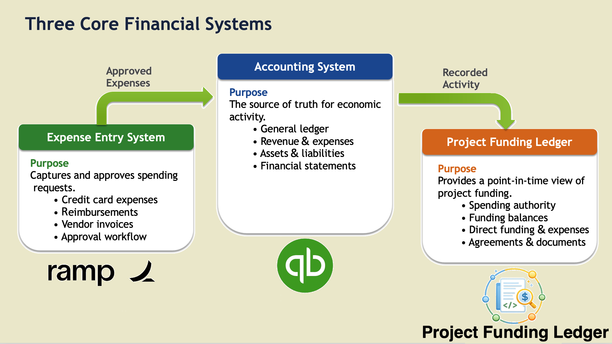
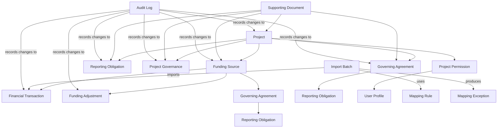

# 1. Introduction 

## 1.1 Purpose
The Project Funding Ledger (PFL) Architecture Design document
defines the technical architecture of the PFL application. It describes
the system architecture, technology stack, application components,
security architecture, database design, data model, integration
architecture, and other technical design decisions that collectively
define how the PFL is constructed.

This document serves as the authoritative technical design specification
for the PFL. It establishes the architectural foundation that guides
software development, promotes consistency across implementation
efforts, and provides the basis for future enhancement of the
application.

## 1.2 Relationship to Other Project Documentation

The PFL documentation is organized into four complementary documents
that collectively define the business requirements, implementation
strategy, technical architecture, and software development approach for
the application. 

Together, these documents provide a complete description of the PFL
while maintaining a clear separation between business requirements,
system design, and software implementation.

The following table summarizes the purpose of each document.

> Document Definition

| Document                                                                                 | Purpose                                                                                                                                                                           |
| ---------------------------------------------------------------------------------------- | --------------------------------------------------------------------------------------------------------------------------------------------------------------------------------- |
| **[Functional Specification](../functional-specification/functional-specification.md)**  | Defines the business requirements, functional capabilities, user workflows, and reporting requirements.                                                                           |
| **[Development Roadmap and Implementation Strategy](../roadmap/development-roadmap.md)** | Defines the overall implementation strategy, development phases, milestones, and project sequencing. *(This document.)*                                                           |
| **[Architecture Design](../architecture/architecture-design.md)**                        | Defines the system architecture, database design, security model, data model, integrations, and technical design decisions.                                                       |
| **[Development Plan](../development/development-plan.md)**                               | Defines the detailed implementation tasks, coding standards, repository structure, development environment, testing procedures, deployment process, and other developer guidance. |

## 

## 1.3 Scope

This document describes the architectural design of Version 1 of the
PFL. It defines the technical structure of the application, including
the system architecture, security architecture, database architecture,
application components, integration architecture, data model, source
system relationships, and supporting technical infrastructure.

This document describes how the PFL is architected. It does not define
business requirements, implementation strategy, development sequencing,
implementation tasks, coding standards, testing procedures, deployment
processes, or project management activities, which are documented
separately.

# 2. System Architecture

The Project Funding Ledger (PFL) is a web-based application
that provides centralized management and visibility of Project funding
information for NumFOCUS. The application uses a Supabase/PostgreSQL
backend together with a browser-based user interface. It combines
imported financial transaction data with project governance, funding,
reporting, and Supporting Document metadata to provide a comprehensive
operational view of each Project.

The frontend technology, application framework, and supporting
middleware may be selected and refined during implementation based on
the application's requirements, contributor expertise, maintainability,
accessibility, security, and long-term sustainability. These
implementation choices must remain consistent with the architectural
principles and security requirements defined in this document.

The PFL complements, rather than replaces, existing operational systems.
QuickBooks Online (QBO) remains the accounting system of record, while
Ramp and other operational platforms continue to manage their respective
business processes. The PFL imports selected accounting data from
QuickBooks Online and combines that information with Project, Funding
Source, Governing Agreement, Reporting Obligation, Project Governance,
Supporting Document, and other application-specific metadata to support
funding visibility, governance, and operational management.

A Project represents the application's primary organizational unit and
security boundary. Each Project contains one or more Funding Sources
representing unrestricted operating funds, grants, contracts, service
agreements, or other sources of financial support. Every imported
Financial Transaction is assigned to a single Funding Source, which
automatically associates the transaction with its parent Project for
reporting, security, and funding visibility.

## 2.1 Architectural Principles

The PFL architecture is based on the following principles:

1.  QuickBooks Online remains the accounting system of record.

2.  The PFL serves as the authoritative operational repository for
    Project funding information while operational and accounting systems
    remain the systems of record for their respective business
    processes.

3.  Imported accounting data remains immutable after import.
    Application-level metadata, including Funding Source assignments,
    may be updated by authorized users without modifying the underlying
    accounting transaction.

4.  Project-level security is the primary access control model.

5.  Supporting Documents are managed as first-class business entities
    rather than simple file attachments.

6.  Project governance, funding authority, and reporting information are
    maintained within the PFL.

7.  Financial Transaction-level accounting support documentation remains
    within the originating operational systems.

8.  The Project Funding Ledger provides a point-in-time operational view
    of available Project funding. It is not an accounting system and
    does not replace the financial systems of record. 

## 2.2 High-Level System Components

The PFL consists of the following major components:

### 2.2.1 Web Application

The web application provides the primary user interface for the Project
Funding Ledger, including dashboards, inquiry screens, Financial
Transaction search, Supporting Document management, reporting obligation
tracking, import administration, Mapping Exception resolution, and
system administration functions.

The implementation may utilize appropriate web application frameworks,
user interface libraries, and supporting middleware that remain
consistent with the architectural principles and security requirements
defined in this document.

### 2.2.2 Supabase Authentication

Supabase Auth manages user authentication, including Google Sign-In,
email/password authentication, and Magic Link support.

### 2.2.3 Supabase/PostgreSQL Database

The PostgreSQL database stores the structured application data for the
Project Funding Ledger. Core business entities include Project, Funding
Source, Financial Transaction, Import Batch, Mapping Rule, Mapping
Exception, Governing Agreement, Reporting Obligation, Supporting
Document, Project Governance, User Profile, Project Permission, Funding
Adjustment, and Audit Log.

### 2.2.4 Supabase Row-Level Security

Row-Level Security (RLS) enforces application authorization using
Project Permissions. Users are granted access to one or more Projects,
and access to associated Funding Sources and related business entities
is inherited automatically through the Project relationship.

### 2.2.5 Supabase Storage

Supporting Document metadata, relationships, lifecycle information, and
storage references are maintained within PostgreSQL. Supabase Storage
stores only the corresponding document files.

### 2.2.6 Import Engine

The Import Engine receives standardized import files generated from
QuickBooks Online (QBO) exports. It validates incoming data, translates
the standardized import format into the Project Funding Ledger's
internal data model, creates Import Batch records, imports immutable
Financial Transaction records, detects duplicate transactions, applies
Mapping Rules, and routes unmapped Financial Transactions to the Mapping
Exception queue.

Financial Transaction imports are expected to be performed manually on a
periodic basis, typically monthly, although the architecture supports
future automation.

### 2.2.7 Mapping Engine

The Mapping Engine assigns imported Financial Transactions to Funding
Sources during the import process. Under normal operation, the
standardized QuickBooks Online (QBO) Class value identifies the
appropriate Funding Source directly. Because each Funding Source belongs
to exactly one Project, the associated Project is derived automatically
from the assigned Funding Source.

The import preparation process is expected to perform the majority of
the data standardization and translation required for successful
imports. This includes transforming legacy or inconsistent QuickBooks
Online Class values into the standardized "Project \| Funding Source"
naming convention used by the Project Funding Ledger.

Mapping Rules provide supplemental administrative configuration for
situations where additional imported attributes, such as QBO Account or
Financial Transaction description, are needed to support specialized
import scenarios, accommodate legacy data, or resolve exceptional cases.

Financial Transactions that cannot be assigned using the standardized
import data and configured Mapping Rules are routed to the Mapping
Exception queue for manual review.

Authorized Program Managers and Financial Managers may update Funding
Source assignments when necessary to improve Project funding visibility.
These changes affect only Project Funding Ledger metadata and never
modify the underlying QuickBooks Online accounting transaction. All
assignment changes are recorded in the Audit Log and may be incorporated
into future Mapping Rules or import preparation procedures.

### 2.2.8 Audit Logging Framework

The Audit Logging Framework records authentication events, metadata
changes, permission changes, document lifecycle events, imports, Funding
Source assignment changes, Mapping Rule modifications, Mapping Exception
resolutions, reporting requirement updates, and administrative
configuration changes to provide complete traceability throughout the
application.

### 2.2.9 Conceptual Business Entity Hierarchy (not a database schema)

The following conceptual hierarchy illustrates the primary organization
of the Project Funding Ledger's core business entities and their
high-level relationships. It is intended to provide an architectural
overview rather than a detailed database schema.

Project

## 2.2.9 Conceptual Business Entity Hierarchy

*This is a conceptual hierarchy, not a database schema.*

The following diagram illustrates the primary organization of the Project Funding Ledger's core business entities and their high-level relationships. It provides an architectural overview rather than a detailed database schema.

The PFL is organized around the Project as the primary organizational
and security boundary. Most core business entities belong directly to a
Project or are associated with a Project through a Funding Source.
Project Permissions establish the application's security boundary by
associating User Profiles with Projects. Supporting Documents and Audit
Log entries are cross-cutting business entities that may relate to
multiple business entities, while Import Batches, Mapping Rules, and
Mapping Exceptions support the Financial Transaction import process
rather than the Project hierarchy itself.

## 2.3 Source System Relationships

The PFL integrates with existing NumFOCUS operational systems while
maintaining clear system-of-record boundaries. The application is
responsible for managing Project funding information and related
operational metadata but does not replace the specialized systems
responsible for accounting, payment processing, expense management, or
financial reporting.

### 2.3.1 QuickBooks Online

QuickBooks Online (QBO) remains the authoritative accounting system of
record. The PFL imports selected accounting transactions from QBO to
provide Project funding visibility while preserving the immutability of
the underlying accounting data.

The PFL does not create, modify, or delete accounting transactions
within QuickBooks Online.

### 2.3.3 Expense Reimbursement Management

Expense reimbursement management is currently performed through manual
intake points and operational workflows. The PFL does not manage expense
reimbursement submission, approval, payment, or transaction-level
accounting support documentation.

Following implementation of Ramp, Ramp is expected to become the system
of record for expense reimbursement workflow and supporting
documentation.

### 2.3.4 Invoice Processing

Invoice processing is currently performed through manual intake points
and operational workflows. The PFL does not manage invoice submission,
approval, payment, or transaction-level accounting support
documentation.

Following implementation of Ramp, Ramp is expected to become the system
of record for invoice processing workflow and supporting documentation.

### 2.3.5 Planned Future Integration – Ramp

Ramp is planned as NumFOCUS's future expense management platform. Upon
implementation, Ramp is expected to become the system of record for
corporate card activity, expense reimbursement management, invoice
processing, payment workflows, and the associated transaction-level
accounting support documentation.

The PFL is designed to coexist with Ramp by maintaining Project funding
metadata and imported Financial Transaction information while leaving
operational expense management processes within Ramp.

### 2.3.6 Project Funding Ledger (PFL)

The PFL is the system of record for the core business entities Project,
Funding Source, Project Governance, Governing Agreement, Reporting
Obligation, Supporting Document, Import Batch, Financial Transaction,
Mapping Rule, Mapping Exception, User Profile, Project Permission,
Funding Adjustment, and Audit Log.

The Financial Transaction business entity represents the PFL's imported
record of accounting activity together with application-specific
metadata, including Funding Source assignment, mapping status, review
information, business relationships, and audit history. The PFL is the
authoritative source for these imported Financial Transaction records
and their associated metadata, while QuickBooks Online remains the
system of record for the underlying accounting transactions.

Supporting Documents are managed as first-class business entities. The
application maintains document metadata, business relationships, version
history, lifecycle status, and security associations, while the
corresponding document files are stored within Supabase Storage.

The PFL does not become the system of record for accounting transactions
or transaction-level accounting support documentation, which remain
within their originating operational systems.

## 2.4 Conceptual Data Flow

The following conceptual workflow illustrates the movement of accounting
data from QuickBooks Online into the Project Funding Ledger. It provides
a high-level overview of the import process rather than the detailed
implementation of the Import Engine.

1.  Financial activity is recorded in QuickBooks Online (QBO).

2.  Authorized staff export selected accounting transactions from QBO.

3.  Authorized staff execute upload preparation procedures to format,
    validate, and standardize the exported QBO data for import,
    including alignment with the "Project \| Funding Source" Class
    naming convention.

4.  The standardized import file is uploaded into the Project Funding
    Ledger.

5.  The Import Engine validates the uploaded file and translates the
    standardized import data into the Project Funding Ledger's internal
    data model.

6.  The system creates an Import Batch and imports immutable Financial
    Transaction records.

7.  The Mapping Engine applies Mapping Rules to assign imported
    Financial Transactions to Funding Sources.

8.  Financial Transactions that cannot be confidently assigned are
    routed to the Mapping Exception queue for manual review.

9.  Authorized Program Managers and Financial Managers review Mapping
    Exceptions and, when appropriate, update Funding Source assignments.
    These changes affect only Project Funding Ledger metadata and do not
    modify the underlying QuickBooks Online accounting transaction.

10. Project stakeholders access only the Projects to which they have
    been granted Project Permissions. Access to associated Funding
    Sources and related business entities is inherited automatically
    through the Project relationship.

## 2.5 System Boundary

The Project Funding Ledger (PFL) is designed to provide Project funding
visibility and operational metadata management. It is not intended to
replace accounting, payment processing, expense management, or other
operational systems.

Accordingly, the PFL is explicitly not responsible for:

- Journal entries

- Accounts payable processing

- Accounts receivable processing

- Donation processing

- Payment processing

- Expense reimbursement processing

- Invoice processing

- Bank reconciliation

- Deferred revenue accounting

- Net asset accounting

- Financial statement preparation

- Updating accounting classifications within QuickBooks Online solely
  for project funding visibility

- Financial Transaction-level invoice, receipt, reimbursement, or
  payment approval documentation

These responsibilities remain within QuickBooks Online, Expensify, Ramp
(following implementation), and other operational systems as
appropriate. The Project Funding Ledger complements these systems by
providing Project funding visibility, governance management, Funding
Source administration, imported Financial Transaction metadata, and
related operational information without replacing the underlying systems
of record.

# 3. Technology Architecture

## 3.1 Technology Philosophy

The Project Funding Ledger is designed as a modern cloud-native web
application that minimizes infrastructure management while providing a
secure, scalable, maintainable, and cost-effective platform.

The architecture emphasizes the use of managed services, standard open
technologies, and a clearly defined separation of responsibilities
between the application, database, authentication, authorization, and
storage layers. Architectural decisions prioritize simplicity,
maintainability, and long-term sustainability over unnecessary technical
complexity..

## 3.2 Overall Technology Stack

The selected technology stack provides a tightly integrated platform
that minimizes custom infrastructure while remaining based on widely
adopted open technologies.

| **Layer**       | **Technology**                      |
|-----------------|-------------------------------------|
| Web Application | Flask & Jinja2                      |
| UI Framework    | Jinja2 Templates                    |
| Language        | Python                              |
| Styling         | Tailwind CSS or equivalent          |
| Backend         | Supabase                            |
| Database        | PostgreSQL                          |
| Authentication  | Supabase Auth                       |
| Authorization   | PostgreSQL Row-Level Security (RLS) |
| File Storage    | Supabase Storage                    |
| API Layer       | Supabase REST API and RPC Functions |

## 3.3 Backend Platform

The backend platform will be implemented using Supabase.

Supabase provides a managed PostgreSQL environment together with
authentication, authorization, object storage, automatically generated
REST APIs, PostgreSQL RPC functions, and administrative tooling. These
services substantially reduce infrastructure management while preserving
the flexibility and portability of a standard PostgreSQL application.

Supabase is responsible for:

- PostgreSQL database

- Authentication

- Authorization

- Row-Level Security

- REST API generation

- PostgreSQL RPC functions

- Object storage

- User management

- Administrative support

## 3.4 Database Platform

PostgreSQL serves as the application's primary persistent data store.

The database contains the core business entities required by the PFL,
including:

- Project

- Funding Source

- Financial Transaction

- Supporting Document

- Governing Agreement

- Reporting Obligation

- Project Governance

- Import Batch

- Mapping Rule

- Mapping Exception

- Funding Adjustment

- User Profile

- Project Permission

- Audit Log

- Supporting reference data

The PFL is t is the system of record for these business entities.
QuickBooks Online remains the authoritative system of record for
accounting transactions.

Imported Financial Transactions remain immutable after import.
Authorized users may modify only Project Funding Ledger metadata
associated with imported transactions, including Funding Source
assignment, mapping status, review information, and related business
metadata.

## 3.5 Currency Treatment

The Project Funding Ledger operates in United States dollars (USD) for
all financial amounts.

NumFOCUS operates in a multi-currency environment; however, the Project
Funding Ledger does not perform currency conversion, maintain foreign
currency balances, or report amounts in source transaction currencies.
All imported Financial Transaction amounts are converted to USD before
upload using the currency conversion values reflected in QuickBooks
Online at the time of the underlying transaction.

Funding Adjustment records are also maintained in USD. Where a Funding
Adjustment relates to historical activity, the adjustment amount
reflects the USD value associated with the transaction or funding
decision at the time it was recorded.

The Project Funding Ledger does not revalue foreign currency activity,
calculate exchange gains or losses, or replace QuickBooks Online as the
accounting system of record for multi-currency accounting.

## 3.6 Web Application

The PFL provides a secure browser-based user interface for interacting
with the application...

The web application provides access to the application's primary
functionality, including:

- Project dashboards

- Funding visibility

- Supporting Document management

- Governing Agreement management

- Reporting Obligation tracking

- Financial Transaction inquiry

- Import administration

- System administration

The implementation may utilize appropriate web application frameworks,
user interface libraries, and supporting middleware selected in
accordance with the architectural principles, security requirements, and
long-term maintainability objectives of the project.

The web application communicates exclusively through the application's
published APIs and does not directly access the database.

## 3.7 User Interface Design

The user interface should provide a clear, consistent, and accessible
user experience that supports efficient interaction with the Project
Funding Ledger. The design should emphasize the presentation of
financial, governance, and Project information while avoiding
unnecessary visual complexity.

The implementation may utilize appropriate user interface frameworks,
styling libraries, and design systems selected in accordance with the
architectural principles and long-term maintainability objectives of the
project.

Primary interface objectives include:

- Responsive layout

- Consistent navigation

- Accessible controls

- Efficient page loading

- Clear presentation of financial and Project information

- Minimal visual clutter

- Consistent interaction patterns

## 3.8 Authentication

Authentication will be managed through Supabase Auth.

Supported authentication methods include:

- Google Sign-In

- Email and password

- Magic Link authentication

Application authorization is independent of authentication.

## Authentication establishes user identity. Authorization decisions are performed independently through the Project Funding Ledger security model.

## 3.9 Authorization

Authorization is implemented using PostgreSQL Row-Level Security (RLS).

Project Permissions establish the application's primary security
boundary. Users receive access only to Projects to which they have been
assigned. Access to Funding Sources and related business entities is
inherited automatically through Project relationships.

System Administrators and Finance Administrators may receive elevated
privileges that permit application administration, import management,
and organization-wide oversight where appropriate.

System Administrators and Finance Administrators may be granted elevated
privileges that bypass Project-level Row-Level Security where
appropriate for system administration, financial oversight, import
administration, and support activities.

## 3.10 File Storage

Supporting Document files are stored within Supabase Storage.

The Supporting Document business entity remains the authoritative record
for each document. PostgreSQL stores all document metadata, business
relationships, lifecycle information, version history, and security
associations. Supabase Storage stores only the underlying binary file.

The Project Funding Ledger manages governance, funding authority,
reporting, and other administrative documents. Accounting support
documentation associated with individual financial transactions remains
within the operational systems that originated those transactions,
including QuickBooks Online, Ramp, and other operational platforms.

These capabilities are outside the scope of Version 1 but can be
incorporated without significant architectural redesign.

# 4. Database Design

## 4.1 Database Design Purpose

The database is the foundation of the PFL. It defines the business
objects, relationships, security boundaries, import history, supporting
document metadata, mapping rules, mapping decisions, and audit records
used throughout the application.

The database is not intended to function as an accounting ledger.
QuickBooks Online remains the authoritative accounting system of record.
The PFL stores imported financial transaction data only for visibility,
reporting, funding authority tracking, and project inquiry.

The database design prioritizes:

- Clear separation between accounting records and project funding
  visibility

- Strong relational integrity

- Project–level security

- Immutable imported accounting data

- Editable application-level Funding Source assignments

- Traceability to source systems

- Auditable metadata changes

- Flexible document management

- Support for future reporting and workflow expansion

## 4.2 Core Database Principles

### 4.2.1 QuickBooks Online Remains the Financial Source of Truth

The database stores imported financial transaction records from QBO, but
it does not create, modify, or replace QBO accounting transactions.

Imported financial transaction records are used for project reporting
and funding visibility only.

### 4.2.2 Imported Financial Transactions Are Immutable

Fields imported from QBO should not be edited after import.

Permitted post-import changes are limited to application-level metadata,
including:

- Funding Source assignment

- Mapping status

- Mapping notes

- Exception resolution fields

- Review status

- Internal notes

Funding Source assignment changes may include moving a financial
transaction from a specific grant, contract, service agreement, or other
dedicated Funding Source to the Project’s General Funding Source. These
changes occur only within the PFL and do not modify QBO Classes,
Customers, Accounts, or other accounting classifications.

### 4.2.3 Every Financial Transaction Belongs to One Funding Source

Each imported Financial Transaction must be assigned to exactly one
Funding Source. Each Funding Source belongs to exactly one Project. A
Financial Transaction’s Project association is therefore derived from
its assigned Funding Source.

Each Project must include a Funding Source named General for
unrestricted project activity or activity not associated with a more
specific Funding Source.

### 4.2.3 All Monetary Amounts Are Stored in USD

The Project Funding Ledger stores all monetary values in United States
dollars (USD).

Imported Financial Transaction amounts are converted to USD during the
import preparation process using the exchange rate reflected in
QuickBooks Online at the time of the underlying accounting transaction.
The database does not store the original transaction currency or perform
currency conversion.

Funding Adjustment records are also maintained in USD using the value
established at the time the adjustment was created.

The Project Funding Ledger does not maintain foreign currency balances
or perform foreign currency revaluation.

### 4.2.5 Projects are the Primary Security Boundary

User access is assigned at the Project level through Project
Permissions.

Access to a Project automatically provides access to the associated core
business entities, including:

- Funding Source,

- Financial Transaction

- Funding Adjustment

- Governing Agreement

- Reporting Obligation

- Project Governance

- Supporting Document

- Mapping Exception

### 4.2.6 Supporting Documents Are Managed Records

Supporting Document is a first-class business entity within the PFL.
Documents are managed system objects rather than simple uploaded files.

The database stores supporting document metadata, version information,
relationships, status, and storage references. The file itself is stored
in Supabase Storage.

### 4.2.7 Auditability Is Built into the Data Model

Key user actions and data changes are recorded in the audit log.

Audit records support transparency, troubleshooting, security review,
and historical accountability.

### 4.2.8 Funding Authority Is Maintained Separately from Accounting Financial Transactions

The PFL stores Funding Sources together with the funding authority,
award amounts, spending authority, and other financial metadata
associated with each Funding Source. A Funding Source may represent an
external grant, service agreement, sponsorship, internal award,
board-approved allocation, unrestricted project funds, or another
approved source of financial support.

Funding Authority records do not require corresponding revenue, expense,
transfer, or allocation financial transactions in QuickBooks Online
unless an actual accounting transaction has occurred. This allows
project stakeholders to see approved funding and available spending
authority without creating artificial accounting activity in the
financial system of record.

For example, an external grant may be represented as a Funding Source
with an award amount and current available balance, while QBO continues
to record only actual accounting activity such as cash receipts,
expenses, receivables, deferred revenue, or revenue recognition entries.

### 4.2.9 Funding Authority May Be Adjusted Within the Ledger

The PFL may include Ledger-only Funding Authority Adjustments that
reduce or increase the available spending authority of a Funding Source
without creating or modifying an accounting transaction in QuickBooks
Online.

Funding Authority Adjustments may be used for items such as NumFOCUS
service fees, internal allocations, spending authority corrections, or
other approved non-financial transactional funding adjustments that are
necessary for project visibility.

These adjustments affect the Funding Source’s available balance within
the PFL only. They do not create journal entries, revenue, expenses,
accounts receivable, accounts payable, or other accounting activity in
QBO. Each adjustment must include an amount, description, effective
date, reason, created by user, and audit history.

## 4.3 Core Business Entities

The Version 1 database includes the following core entities:

1.  Project

2.  Funding Source

3.  Project Governance

4.  Governing Agreement

5.  Reporting Obligation

6.  Supporting Document

7.  Import Batch

8.  Financial Transaction

9.  Mapping Rule

10. Mapping Exception

11. User Profile

12. Project Permission

13. Funding Adjustment

14. Audit Log

## 4.4 Entity Relationship Summary

1.  A Project may have many Funding Sources.

2.  A Project must have one Funding Source named General.

3.  A Funding Source belongs to one Project.

4.  A Project may have many Governing Agreements.

5.  A Funding Source may have many Governing Agreements.

6.  A Project may have many Reporting Obligations.

7.  A Funding Source may have many Reporting Obligations.

8.  A Governing Agreement may have many Reporting Obligations.

9.  A Project may have many Project Governance records.

10. A Project may have many Supporting Documents.

11. A Funding Source may have many Supporting Documents.

12. A Governing Agreement may have one or more related Supporting
    Documents.

13. A Reporting Obligation may have one or more related Supporting
    Documents.

14. A Project Governance record may have one or more related Supporting
    Documents.

15. A Funding Source may have many Funding Adjustments.

16. An Import Batch may contain many Financial Transactions.

17. A Financial Transaction belongs to one Import Batch.

18. A Financial Transaction must be assigned to one Funding Source.

19. A Mapping Rule may assign many Financial Transactions.

20. A Mapping Exception belongs to one Financial Transaction and one
    Import Batch.

21. A User Profile may have many Project Permissions.

22. A Project may have many Project Permissions.

23. A Project Permission associates one User Profile with one Project.

24. Audit Log records may reference one or more core business entities
    together with the action performed, timestamp, and user responsible
    for the change.

## 4.5 Naming Conventions

Database tables should use lowercase, singular snake_case names.

Examples:

- project

- funding_source

- financial transaction

- import_batch

- mapping_exception

- reporting_obligation

Primary keys should use the field name \`id\`.

Foreign keys should use the related table name followed by \`\_id\`.

Examples:

- project_id

- funding_source_id

- governing_agreement_id

- supporting_document_id

- import_batch_id

- user_id

Timestamp fields should use:

- created_at

- updated_at

- deleted_at, where soft deletion is supported

User reference fields should use:

- created_by_user_id

- updated_by_user_id

- uploaded_by_user_id

- resolved_by_user_id

## 4.6 Standard Table Fields

Most business tables should include the following standard fields:

- id

- created_at

- updated_at

- created_by_user_id

- updated_by_user_id

- status

- notes

Where records should not be physically deleted, tables should also
include:

- deleted_at

- deleted_by_user_id

Soft deletion should be preferred for major business records such as
Projects, Funding Sources, Governing Agreements, Supporting Documents,
and Reporting Obligations.

## 4.7 Enumerated Values

The database should use controlled values for key business fields to
improve consistency and reporting.

Controlled values may be implemented using PostgreSQL enum types or
lookup tables. Lookup tables are preferred where values may change over
time or need administrative management.

Initial controlled-value fields include:

- Project Status

- Funding Source Category

- Funding Source Methodology

- Restriction Status

- Governing Agreement Type

- Project Governance Type

- Project Governance Status

- Document Type

- Document Status

- Reporting Obligation Status

- Import Batch Status

- Mapping Rule Status

- Mapping Exception Status

- Funding Adjustment Type

- Funding Adjustment Status

- Project Permission Role

- User Type

- User Status

## 4.8 Deletion and Retention Philosophy

The system should avoid hard deletion of core business records.

Instead, records should generally be deactivated, closed, archived,
expired, or soft deleted.

Hard deletion may be appropriate for:

- Failed import staging records

- Temporary upload records

- Development or test data

- Records created in error before they are used

Financial Transactions imported from QBO should not be deleted through
normal application workflows. If an import must be reversed, the system
should record the Import Batch as reversed and preserve the import
history.

## 4.9 Version 1 Database Scope

Version 1 should include the database structures required to support:

- User authentication profile extension

- Project-level permissions

- Project metadata

- Funding Source metadata

- Project Governance

- Governing Agreement records

- Reporting Obligation records

- Supporting Document metadata and storage references

- QBO financial transaction imports

- Import batch traceability

- Mapping rules

- Mapping exceptions

- Funding Source assignment changes

- Audit logging

- Dashboard and export queries

The database should not include structures for:

- Journal entries

- Accounts payable processing

- Accounts receivable processing

- Donation processing

- Payment processing

- Invoice processing

- Bank reconciliation

- Deferred revenue accounting

- Net asset accounting

- Expense reimbursement workflow

- Invoice approval workflow

- Financial Transaction-level accounting support document management

## 4.10 Table Definitions

This section defines the primary database tables required for Version 1
of the PFL. The table definitions describe the purpose of each table,
key fields, relationships, and design notes.

Detailed SQL migration scripts will be developed separately from this
design specification.

## 4.10.1 organization

The organization table stores NumFOCUS fiscally sponsored projects,
conferences, programs, operational initiatives, and other organizational
activities tracked within the PFL.

The organization table is the primary security boundary for the application.

The organization table provides the organizational container for Funding
Sources, Project Governance, Governing Agreements, Supporting Documents,
and Reporting Obligations. Financial Transactions are associated with
the Organization through their assigned Funding Source.

Key Fields

| **Field** | **Type** | **Required** | **Notes** |
|----|----|----|----|
| id | uuid | Yes | Primary key (references organization_key.id) |
| organization_name | text | Yes | Official organization name |
| organization_slug | text | Yes | URL-safe unique identifier |
| status | text | Yes | Active, inactive, archived, dormant, closed |
| organization_type | text | Yes | Fiscal Sponsorship, Event |
| description | text | No | General organization description |
| website_url | text | No | Public organization website |
| source_code_url | text | No | Public source code repository URL |
| donation_url | text | No | Donation page URL |
| join_date | date | No | Date the organization joined NumFOCUS |
| created_at | timestamp | Yes | Record creation timestamp |
| updated_at | timestamp | Yes | Last update timestamp |
| created_by_user_id | uuid | No | User who created the record |
| updated_by_user_id | uuid | No | User who last updated the record |
| deleted_at | timestamp | No | Soft deletion timestamp |
| deleted_by_user_id | uuid | No | User who soft deleted the record |

### 4.10.1.1 Relationships

An Organization belongs to exactly one Organization Key.

An Organization has one related Organization Internal record.

An Organization may have many Funding Sources.

An Organization may have many Project Governance items.

An Organization may have many related Supporting Documents.

An Organization may have many Governing Agreements through Funding Sources.

An Organization may have many Reporting Obligations through Funding Sources.

An Organization may have many Financial Transactions through Funding Sources.

### 4.10.1.2 Design Notes

Organization records should be relatively stable. Organization names should not be
used as foreign keys. All relationships should use organization_id.

## 4.10.1.3 organization_key

The organization_key table provides a layer of indirection for the
organization identifier. It maps an auto-generated unique ID to a
user-specified import key.

Key Fields

| **Field** | **Type** | **Required** | **Notes** |
|----|----|----|----|
| id | uuid | Yes | Primary key (auto-generated) |
| import_key | text | Yes | Unique user-specified string identifier |
| created_at | timestamp | Yes | Record creation timestamp |
| updated_at | timestamp | Yes | Last update timestamp |
| created_by_user_id | uuid | No | User who created the record |
| updated_by_user_id | uuid | No | User who last updated the record |

### 4.10.1.3.1 Relationships

An Organization Key has a one-to-one relationship with an Organization.

### 4.10.1.3.2 Design Notes

This table allows internal system foreign keys to remain stable UUIDs while
accommodating changes, remapping, or customization of the user-specified
import identifiers.

## 4.10.1.4 organization_internal

The organization_internal table stores restricted/private organization
metadata. It requires more restrictive permissions to access columns
like internal notes and overhead rates.

Key Fields

| **Field** | **Type** | **Required** | **Notes** |
|----|----|----|----|
| id | uuid | Yes | Primary key (references organization.id) |
| overhead_grant | numeric | Yes | Overhead rate for grants (default 0.0) |
| overhead_donation_general | numeric | Yes | Overhead rate for general donations (default 0.0) |
| overhead_donation_corporate | numeric | Yes | Overhead rate for corporate donations (default 0.0) |
| notes | text | No | Internal private notes |
| created_at | timestamp | Yes | Record creation timestamp |
| updated_at | timestamp | Yes | Last update timestamp |
| created_by_user_id | uuid | No | User who created the record |
| updated_by_user_id | uuid | No | User who last updated the record |
| deleted_at | timestamp | No | Soft deletion timestamp |
| deleted_by_user_id | uuid | No | User who soft deleted the record |

### 4.10.1.4.1 Relationships

An Organization Internal record belongs to exactly one Organization.

### 4.10.1.4.2 Design Notes

This table enforces strict role-based access control (RBAC) separating public
organization metadata from private financial and administrative overhead details.

## 4.10.2 funding_source

The funding_source table stores grants, service agreements, fiscal
sponsorship funds, conference funds, board-designated funds,
sponsorships, awards, general funds, or other sources of spending
authority available to a Project.

Funding Sources remain available for historical reporting after
expiration or completion and are normally closed rather than deleted.

Key Fields

| **Field** | **Type** | **Required** | **Notes** |
|----|----|----|----|
| id | uuid | Yes | Primary key |
| project_id | uuid | Yes | Foreign key to project |
| funding_source_name | text | Yes | Name of the funding source |
| category | text | Yes | Grant, Service Governing Agreement , Fiscal Sponsorship, General Funds, Board-Designated Funds, Conference Funds, Prize or Award, Other |
| qbo_class | text | No | Related QBO Class value |
| funding_organization | text | No | Funder, sponsor, customer, or internal authority |
| agreement_type | text | No | Grant, service agreement, sponsorship, subaward, internal authorization, other |
| funding_source_methodology | text | No | Advance Funding, Cost Reimbursement, Milestone-Based, Other |
| funding_authority | numeric | No | Total authorized funding amount |
| start_date | date | No | Funding source start date |
| end_date | date | No | Funding source end date |
| restriction_status | text | No | Unrestricted, donor restricted, board designated, contractual, other |
| status | text | Yes | Active, pending, inactive, closed, expired, archived |
| notes | text | No | Internal notes |
| created_at | timestamp | Yes | Record creation timestamp |
| updated_at | timestamp | Yes | Last update timestamp |
| created_by_user_id | uuid | No | User who created the record |
| updated_by_user_id | uuid | No | User who last updated the record |
| deleted_at | timestamp | No | Soft deletion timestamp |
| deleted_by_user_id | uuid | No | User who soft deleted the record |

### 4.10.2.1 Relationships

A Funding Source belongs to one Project.

A Funding Source may have many Financial Transactions.

A Funding Source may have many Funding Adjustments.

A Funding Source may have many Governing Agreements.

A Funding Source may have many Reporting Obligations.

A Funding Source may have many Documents.

Access to a Funding Source is inherited through the parent Project.

### 4.10.2.2 Design Notes

Funding Sources are not QBO accounts and should not be confused with
accounting balances.

The qbo_class field stores the standardized QuickBooks Online Class
associated with the Funding Source. QBO Class values should generally
follow the “Project \| Funding Source” naming convention and are
expected to drive the primary financial transaction mapping process
during imports.

Funding Authority is editable metadata representing approved spending
authority, not an accounting balance.

Available Funding Authority is calculated as:

Available Funding Authority

= Original Funding Authority

Plus or Minus: Approved Funding Adjustments

Plus or Minus: Imported Financial Transactions

Project Permissions determine user access throughout the application.
Access to Funding Sources is inherited through the related Project.

The PFL does not calculate Funding Source availability using GAAP
revenue recognition, deferred revenue, cash receipt timing,
reimbursement status, or other accounting recognition methods. Available
Funding Authority represents approved spending authority for project
visibility purposes.

Funding Adjustments are used to increase or reduce available spending
authority when approved funding authority differs from imported QBO
financial transaction activity. This allows the ledger to present
project-facing funding availability without creating artificial
accounting transactions or requiring different balance calculation
methodologies for grants, service agreements, contracts, internal
allocations, or other funding arrangements.

## 4.10.3 project_governance

The project_governance table stores project-level governance records
that establish or document the relationship between NumFOCUS and a
Project.

Examples include Fiscal Sponsorship Governing Agreements, Fiscal
Sponsorship Governing Agreement amendments, project onboarding
approvals, governance correspondence, and other project-level governing
materials.

Key Fields

| **Field** | **Type** | **Required** | **Notes** |
|----|----|----|----|
| id | uuid | Yes | Primary key |
| project_id | uuid | Yes | Foreign key to project |
| governing_agreement_id | uuid | No | Foreign key to governing_agreement |
| governance_record_name | text | Yes | Name of the governance record |
| governance_record_type | text | Yes | FSA, FSA Amendment, Project Approval, Governance Correspondence, Other |
| effective_date | date | No | Effective date of the governance record |
| expiration_date | date | No | Expiration date, if applicable |
| status | text | Yes | Active, superseded, expired, archived |
| supporting_document_id | uuid | No | Optional primary related document (foreign key to supporting_document |
| notes | text | No | Internal notes |
| created_at | timestamp | Yes | Record creation timestamp |
| updated_at | timestamp | Yes | Last update timestamp |
| created_by_user_id | uuid | No | User who created the record |
| updated_by_user_id | uuid | No | User who last updated the record |
| deleted_at | timestamp | No | Soft deletion timestamp |
| deleted_by_user_id | uuid | No | User who soft deleted the record |

### 4.10.3.1 Relationships

A Project Governance record belongs to one Project.

A Project Governance record may reference one primary Document and may
be associated with multiple document versions over time.

A Project may have many Project Governance items.

### 4.10.3.2 Design Notes

Project Governance records represent governance events or relationships,
while Documents represent the physical files associated with those
records. Separating governance records from document storage allows the
PFL to maintain governance history independently of document versions
and supports replacement or superseding documents without losing the
underlying governance record.

## 4.10.4 governing_agreement

The governing_agreement table stores agreements, award letters,
contracts, sponsorship agreements, subawards, amendments, and similar
records that establish or modify the legal, financial, operational, or
reporting terms governing a Project or one its Funding Sources.

Key Fields

<table>
<colgroup>
<col style="width: 35%" />
<col style="width: 11%" />
<col style="width: 10%" />
<col style="width: 43%" />
</colgroup>
<thead>
<tr>
<th><strong>Field</strong></th>
<th><strong>Type</strong></th>
<th><strong>Required</strong></th>
<th><strong>Notes</strong></th>
</tr>
</thead>
<tbody>
<tr>
<td>id</td>
<td>uuid</td>
<td>Yes</td>
<td>Primary key</td>
</tr>
<tr>
<td>project_id</td>
<td>uuid</td>
<td>Yes</td>
<td>Foreign key to project</td>
</tr>
<tr>
<td>funding_source_id</td>
<td>uuid</td>
<td>No</td>
<td>Foreign key to funding_source</td>
</tr>
<tr>
<td>agreement_name</td>
<td>text</td>
<td>Yes</td>
<td>Name of the agreement</td>
</tr>
<tr>
<td>agreement_type</td>
<td>text</td>
<td>Yes</td>
<td>
Fiscal Sponsorship Agreement

Grant

Award Letter

Service Agreement

Contract

Sponsorship Agreement

Subaward Agreement

Amendment

Memorandum of Understanding

Other
</td>
</tr>
<tr>
<td>agreement_subtype</td>
<td>text</td>
<td>No</td>
<td>Optional subtype</td>
</tr>
<tr>
<td>funder_customer_contracting_party</td>
<td>text</td>
<td>No</td>
<td>Contracting party</td>
</tr>
<tr>
<td>underlying_funding_source</td>
<td>text</td>
<td>No</td>
<td>Underlying funder or award source, if different</td>
</tr>
<tr>
<td>prime_award_recipient</td>
<td>text</td>
<td>No</td>
<td>Prime award recipient, if applicable</td>
</tr>
<tr>
<td>original_agreement_amount</td>
<td>numeric</td>
<td>No</td>
<td>Award or agreement amount</td>
</tr>
<tr>
<td>agreement_year</td>
<td>integer</td>
<td>No</td>
<td>Calendar year in which the original agreement was first
executed.</td>
</tr>
<tr>
<td>start_date</td>
<td>date</td>
<td>No</td>
<td>Governing Agreement start date</td>
</tr>
<tr>
<td>end_date</td>
<td>date</td>
<td>No</td>
<td>Governing Agreement end date</td>
</tr>
<tr>
<td>status</td>
<td>text</td>
<td>Yes</td>
<td>Draft, active, expired, closed, superseded, archived</td>
</tr>
<tr>
<td>supporting_document_id</td>
<td>uuid</td>
<td>No</td>
<td>Primary supporting_document representing this Governing
Agreement</td>
</tr>
<tr>
<td>notes</td>
<td>text</td>
<td>No</td>
<td>Internal notes</td>
</tr>
<tr>
<td>created_at</td>
<td>timestamp</td>
<td>Yes</td>
<td>Record creation timestamp</td>
</tr>
<tr>
<td>updated_at</td>
<td>timestamp</td>
<td>Yes</td>
<td>Last update timestamp</td>
</tr>
<tr>
<td>created_by_user_id</td>
<td>uuid</td>
<td>No</td>
<td>User who created the record</td>
</tr>
<tr>
<td>updated_by_user_id</td>
<td>uuid</td>
<td>No</td>
<td>User who last updated the record</td>
</tr>
<tr>
<td>deleted_at</td>
<td>timestamp</td>
<td>No</td>
<td>Soft deletion timestamp</td>
</tr>
<tr>
<td>deleted_by_user_id</td>
<td>uuid</td>
<td>No</td>
<td>User who soft deleted the record</td>
</tr>
</tbody>
</table>

### 4.10.4.1 Relationships

A Governing Agreement belongs to one Project.

A Governing Agreement may belong to one Funding Source.

A Governing Agreement may reference one primary Supporting Document.

A Governing Agreement may have many Reporting Obligations.

### 4.10.4.2 Design Notes

A Governing Agreement may exist before a Funding Source is fully
configured. For that reason, funding_source_id may be null in Version 1.

When funding_source_id is null, the Governing Agreement governs the
Project as a whole. When funding_source_id is populated, the Governing
Agreement governs the specified Funding Source within the Project.

A Governing Agreement may apply either to the Project as a whole or to a
single Funding Source within the Project. A Governing Agreement shall
not be associated with multiple Funding Sources. When substantially
different funding arrangements exist, separate Governing Agreement
records should be created.

## 4.10.5 reporting_obligation

The reporting_obligation table tracks financial, technical, compliance,
grant, contract, or internal reporting obligations associated with a
Funding Source or Governing Agreement .

Key Fields

| **Field** | **Type** | **Required** | **Notes** |
|----|----|----|----|
| id | uuid | Yes | Primary key |
| project_id | uuid | Yes | Foreign key to project |
| funding_source_id | uuid | No | Foreign key to funding_source |
| governing_agreement_id | uuid | No | Foreign key to governing_agreement |
| report_title | text | Yes | Title of the report or reporting obligation |
| report_description | text | No | Brief description or reporting instructions |
| report_type | text | Yes | Financial, Technical, Compliance, Progress, Final, Internal, Other |
| due_date | date | No | Due date |
| reporting_period_start | date | No | Reporting period start |
| reporting_period_end | date | No | Reporting period end |
| reporting_frequency | text | No | One-Time, Monthly, Quarterly, Semi-Annual, Annual, Milestone, Other |
| required_by | text | No | Organization or party requiring the report |
| responsible_user_id | uuid | No | User responsible for tracking or submission |
| status | text | Yes | Not Started, In Progress, Submitted, Accepted, Completed, Overdue, Not Required, Archived |
| submission_date | date | No | Date submitted |
| completed_date | date | No | Date the reporting requirement was completed or otherwise satisfied |
| accepted_date | date | No | Date accepted, if known |
| supporting_document_id | uuid | No | Report document or related supporting documentation – foreign key to supporting_document |
| external_reference | text | No | Funder report identifier, portal ID, or external tracking number |
| notes | text | No | Internal notes |
| created_at | timestamp | Yes | Record creation timestamp |
| updated_at | timestamp | Yes | Last update timestamp |
| created_by_user_id | uuid | No | User who created the record |
| updated_by_user_id | uuid | No | User who last updated the record |
| deleted_at | timestamp | No | Soft deletion timestamp |
| deleted_by_user_id | uuid | No | User who soft deleted the record |

### 4.10.5.1 Relationships

A Reporting Obligation belongs to one Project.

A Reporting Obligation may reference one Funding Source.

A Reporting Obligation may reference one Governing Agreement.

A Reporting Obligation may have many Supporting Documents.

### 4.10.5.2 Design Notes

Reporting Obligations provide a centralized schedule of financial,
technical, compliance, grant, contract, and internal reporting
activities associated with Projects, Funding Sources, and Governing
Agreements.

Reporting Obligations should be visible to authorized Program Managers
and Fiscally Sponsored Project Stakeholders based on Project
Permissions.

The system tracks reporting obligations, due dates, reporting periods,
responsible users, submission status, completion status, acceptance
status, external references, and related documents. The system does not
generate, prepare, or submit reports in Version 1.

## 4.10.6 supporting_document

The supporting_document table stores metadata for administrative,
governance, funding, compliance, reporting, and other supporting
documents maintained by the PFL.

Supporting Documents provide the documentary evidence associated with
Projects, Funding Sources, Governing Agreements, Project Governance
records, and Reporting Obligations. Examples include grant award
letters, executed agreements, amendments, approved budgets, board
resolutions, reporting instructions, submitted reports, sponsor
correspondence, and other records that support project funding
administration and compliance.

The document file itself is stored in Supabase Storage. The PFL stores
the searchable metadata, business relationships, version history, and
lifecycle information necessary to organize, secure, and retrieve those
documents.

Key Fields

| **Field** | **Type** | **Required** | **Notes** |
|----|----|----|----|
| id | uuid | Yes | Primary key |
| document_name | text | Yes | User-facing document name |
| document_type | text | Yes | Award Letter, Grant Agreement, Grant Amendment, Service Agreement, Sponsorship Agreement, Subaward Agreement, Approved Budget, Funding Correspondence, Board Resolution, Governance Document, Report, Report Template, Other |
| project_id | uuid | No | Foreign key to project |
| funding_source_id | uuid | No | Foreign key to funding_source |
| governing_agreement_id | uuid | No | Foreign key to governing_agreement |
| governance_record_id | uuid | No | Foreign key to project_governance |
| reporting_obligation_id | uuid | No | Foreign key to reporting_obligation |
| storage_bucket | text | Yes | Supabase Storage bucket |
| storage_path | text | Yes | Supabase Storage object path |
| original_file_name | text | Yes | Original uploaded file name |
| file_type | text | No | MIME type or file extension |
| file_size | bigint | No | File size in bytes |
| version | integer | Yes | Document version number |
| effective_date | date | No | Effective date |
| expiration_date | date | No | Expiration date |
| status | text | Yes | Draft, Active, Superseded, Expired, Archived |
| uploaded_by_user_id | uuid | No | User who uploaded the document |
| uploaded_at | timestamp | Yes | Upload timestamp |
| notes | text | No | Internal notes |
| created_at | timestamp | Yes | Record creation timestamp |
| updated_at | timestamp | Yes | Last update timestamp |
| deleted_at | timestamp | No | Soft deletion timestamp |
| deleted_by_user_id | uuid | No | User who soft deleted the document |

### 4.10.6.1 Relationships

A Project may have many Supporting Documents.

A Funding Source may have many Supporting Documents.

An Agreement may have many Supporting Documents.

A Project Governance record may have many Supporting Documents.

A Reporting Obligation may have many Supporting Documents.

A Supporting Document belongs to one and only one primary business
entity.

A Supporting Document may reference one or more supported business
entities simultaneously.

### 4.10.6.2 Design Notes

Supporting Documents provide centralized metadata management, version
control, and lifecycle management for governance, funding, agreement,
reporting, compliance, and other administrative records maintained by
the PFL.

Each Supporting Document should normally be associated with a single
primary business entity. The associated entity determines where the
document appears within the application. For example, grant award
letters and approved budgets are typically associated with a Funding
Source, while project charters and governance policies are associated
with a Project.

Supporting Documents inherit access permissions through their associated
Project. Relationships to Funding Sources, Agreements, Project
Governance records, and Reporting Obligations provide navigation and
business context but do not establish independent security boundaries.

The system is not intended to store vendor invoices, receipts,
reimbursement support, credit card documentation, payment approvals, or
other transaction-level accounting support documents. Those records
remain within operational systems such as QuickBooks Online, Expensify,
and, following implementation, Ramp.

Multiple versions of the same logical Supporting Document may exist.
Earlier versions should normally be retained for historical reference
unless organizational retention policies require their removal.

## 4.10.7 import_batch

The import_batch table stores information about each QBO financial
transaction import event.

The import_batch table provides traceability between imported financial
transaction records and the source file used during import.

Key Fields

| **Field** | **Type** | **Required** | **Notes** |
|----|----|----|----|
| id | uuid | Yes | Primary key |
| import_date | timestamp | Yes | Import date and time |
| imported_by_user_id | uuid | No | User who performed the import |
| source_file_name | text | Yes | Uploaded import file name |
| source_file_hash | text | Yes | Hash used for duplicate detection |
| source_system | text | Yes | QuickBooks Online |
| Source_record_count | integer | Yes | Number of rows processed |
| processing_started_at | timestamp | No | Import processing began |
| processing_completed_at | timestamp | No | Import processing completed |
| imported_count | integer | Yes | Number of financial transactions imported |
| exception_count | integer | Yes | Number of mapping or validation exceptions |
| status | text | Yes | Draft, Imported, Imported with Exceptions, Failed, Reversed |
| error_summary | text | No | Summary of import errors |
| notes | text | No | Internal notes |
| created_at | timestamp | Yes | Record creation timestamp |
| updated_at | timestamp | Yes | Last update timestamp |
| deleted_at | timestamp | No | Soft deletion timestamp |
| deleted_by_user_id | uuid | No | User who soft deleted the record |

### 4.10.7.1 Relationships

An Import Batch may contain many Financial Transactions.

An Import Batch may contain many Mapping Exceptions.

An Import Batch is created by one User.

### 4.10.7.2 Design Notes

The Import Batch table provides a complete audit trail for each
financial transaction import, including the source file, processing
results, and import status.

Source file hashes are used to detect duplicate imports and help prevent
accidental reprocessing of the same financial transaction export.

Import history should be preserved even when an import is reversed.
Reversal should not physically delete imported financial transactions
unless explicitly permitted through an administrative maintenance
process.

An Import Batch records the outcome of an import operation but does not
modify previously imported accounting data. Imported financial
transaction records remain immutable except for application-level
metadata managed by the PFL.

## 4.10.8 financial_transaction

The financial_transaction table stores imported QBO financial accounting
transactions used for project funding visibility and reporting.

Financial Transactions are immutable with respect to source QBO fields.
After import, only application-level assignment, mapping, review, and
internal note fields may be updated.

Key Fields

| **Field** | **Type** | **Required** | **Notes** |
|----|----|----|----|
| id | uuid | Yes | Primary key |
| qbo_financial_id | text | No | QBO financial transaction identifier, if available |
| import_batch_id | uuid | Yes | Foreign key to import_batch |
| transaction_date | date | Yes | QBO financial transaction date |
| transaction_type | text | No | Bill, Expense, Check, Deposit, Journal Entry, Invoice, Payment, Other |
| payee_vendor | text | No | Payee or vendor name |
| customer | text | No | QBO customer, if available |
| account | text | No | QBO account |
| memo_description | text | No | Memo, description, or detail field |
| amount | numeric | Yes | Financial Transaction amount |
| qbo_class | text | No | QBO Class imported from QBO |
| funding_source_id | uuid | No | Assigned Funding Source |
| qbo_reference_number | text | No | QBO reference number |
| source_file_row_number | integer | No | Source import file row number |
| mapping_status | text | Yes | Mapped, Unmapped, Exception, Ignored |
| mapping_confidence | numeric | No | Optional mapping confidence score |
| mapping_notes | text | No | Mapping notes |
| notes | text | No | Internal notes |
| imported_at | timestamp | Yes | Import timestamp |
| created_at | timestamp | Yes | Record creation timestamp |
| updated_at | timestamp | Yes | Last update timestamp |
| created_by_user_id | uuid | No | User who created the record (normally the system during import) |
| updated_by_user_id | uuid | No | User who last updated application metadata |
| deleted_at | timestamp | No | Soft deletion timestamp |
| deleted_by_user_id | uuid | No | User who soft deleted the record |

### 4.10.8.1 Relationships

A Financial Transaction belongs to one Import Batch.

A Financial Transaction may be assigned to one Funding Source.

A Financial Transaction is associated with one Project through its
assigned Funding Source.

A Financial Transaction may have one Mapping Exception.

### 4.10.8.2 Design Notes

Source fields imported from QBO should not be edited after import.

Each reportable Financial Transaction must ultimately be assigned to
exactly one Funding Source. Because each Funding Source belongs to
exactly one Project, the Financial Transaction’s Project association is
derived from the assigned Funding Source.

Only application-level assignment, mapping, review, and internal note
fields may be updated after import.

Financial Transactions should remain traceable to QBO and to the Import
Batch that created them.

## 4.10.9 mapping_rule

The mapping_rule table stores administrator-defined rules used by the
Mapping Engine to assign imported QBO financial transactions to Projects
and Funding Sources.

Key Fields

| **Field** | **Type** | **Required** | **Notes** |
|----|----|----|----|
| id | uuid | Yes | Primary key |
| rule_name | text | Yes | User-friendly rule name |
| description | text | No | Optional description of the rule |
| priority | integer | Yes | Evaluation order (lower numbers evaluated first) |
| is_active | boolean | Yes | Indicates whether the rule is active |
| transaction_type | text | No | Match on transaction type |
| payee_vendor | text | No | Match on payee or vendor |
| customer | text | No | Match on QBO customer |
| account | text | No | Match on QBO account |
| qbo_class | text | No | Match on imported QBO Class |
| memo_contains | text | No | Match when memo or description contains text |
| amount_min | numeric | No | Minimum amount for rule match |
| amount_max | numeric | No | Maximum amount for rule match |
| funding_source_id | uuid | Yes | Funding Source assigned when the rule matches |
| notes | text | No | Internal notes |
| created_at | timestamp | Yes | Record creation timestamp |
| updated_at | timestamp | Yes | Last update timestamp |
| created_by_user_id | uuid | No | User who created the rule |
| updated_by_user_id | uuid | No | User who last updated the rule |
| deleted_at | timestamp | No | Soft deletion timestamp |
| deleted_by_user_id | uuid | No | User who soft deleted the rule |

### 4.10.9.1 Relationships

A Mapping Rule assigns Financial Transactions to one Funding Source.

A Funding Source may have many Mapping Rules.

A Mapping Rule may be created or maintained by one User.

### 4.10.9 Design Notes

Mapping Rules are used to suggest or apply Financial Transaction
assignments during import and mapping review.

Rules should be evaluated in priority order.

Rules assign Financial Transactions to Funding Sources. Project
association is derived from the assigned Funding Source.

Rules should not modify immutable QBO financial transaction fields.

If multiple active rules match the same Financial Transaction, the
system should apply the highest-priority rule or route the Financial
Transaction to Mapping Exceptions when the match is ambiguous.

Mapping Rules may be created manually by authorized users. Mapping
Exception resolutions may inform future Mapping Rules, but Version 1
does not need to generate Mapping Rules automatically.

## 4.10.10 mapping_exception

The mapping_exception table stores imported Financial Transactions that
could not be automatically assigned to a Funding Source or require
manual review.

Key Fields

| **Field** | **Type** | **Required** | **Notes** |
|----|----|----|----|
| id | uuid | Yes | Primary key |
| financial_transaction_id | uuid | Yes | Foreign key to financial_transaction |
| import_batch_id | uuid | Yes | Foreign key to import_batch |
| exception_type | text | Yes | Unmapped Funding Source, Ambiguous Match, Validation Error, Duplicate Suspected, Missing Required Data, Other |
| exception_description | text | No | Description of the issue |
| assigned_to_user_id | uuid | No | User assigned to review |
| status | text | Yes | Open, In Review, Resolved, Ignored |
| resolution_funding_source_id | uuid | No | Funding Source selected during resolution |
| resolution_notes | text | No | Resolution notes |
| resolved_by_user_id | uuid | No | User who resolved the exception |
| resolved_at | timestamp | No | Resolution timestamp |
| created_at | timestamp | Yes | Record creation timestamp |
| updated_at | timestamp | Yes | Last update timestamp |
| created_by_user_id | uuid | No | User who created the record (normally the system during import) |
| updated_by_user_id | uuid | No | User who last updated the record |
| deleted_at | timestamp | No | Soft deletion timestamp |
| deleted_by_user_id | uuid | No | User who soft deleted the record |

### 4.10.10.1 Relationships

A Mapping Exception belongs to one Financial Transaction.

A Mapping Exception belongs to one Import Batch.

A Mapping Exception may be assigned to one User.

A Mapping Exception may be resolved by assigning one Funding Source to
the associated Financial Transaction or by marking the exception as
Ignored.

### 4.10.10.2 Design Notes

Mapping Exceptions represent imported Financial Transactions that could
not be confidently assigned to a Funding Source during import or that
require manual review.

Resolving a Mapping Exception updates the assigned Funding Source for
the associated Financial Transaction. The associated Project is derived
automatically from the assigned Funding Source.

Resolving a Mapping Exception must not modify immutable QBO source
fields.

Repeated Mapping Exception resolutions may inform the creation of future
Mapping Rules, although Version 1 does not automatically generate
Mapping Rules.

## 4.10.11 user_profile

The user_profile table extends Supabase Auth users with
application-specific profile and role information.

Key Fields

| **Field** | **Type** | **Required** | **Notes** |
|----|----|----|----|
| id | uuid | Yes | Primary key |
| auth_user_id | uuid | Yes | Supabase Auth user identifier |
| full_name | text | Yes | User full name |
| email | text | Yes | User email address |
| organization_affiliation | text | No | Organization, institution, or project affiliation |
| user_type | text | Yes | System Administrator, Finance Administrator, Program Manager, Project Stakeholder |
| status | text | Yes | Active, Invited, Inactive, Suspended |
| last_login_at | timestamp | No | Last known login |
| created_at | timestamp | Yes | Record creation timestamp |
| updated_at | timestamp | Yes | Last update timestamp |
| created_by_user_id | uuid | No | User who created the profile |
| updated_by_user_id | uuid | No | User who last updated the profile |
| deleted_at | timestamp | No | Soft deletion timestamp |
| deleted_by_user_id | uuid | No | User who soft deleted the profile |

### 4.10.11.1 Relationships

A User may have many Project Permissions.

A User may create, update, upload, resolve, or review many business
records.

### 4.10.11.2 Design Notes

Authentication is managed by Supabase Auth.

The user_profile table stores application-specific user information that
supplements Supabase Auth.

Application authorization is managed through Project Permissions. User
Type identifies the user's general application role but does not, by
itself, grant access to Projects, Funding Sources, or related records.

## 4.10.12 project_permission

The project_permission table assigns users to Projects and defines their
access level.

The project_permission table is central to the application security
model. Project-level permissions determine whether a user may view,
manage, or administer a Project and its related records.

Key Fields

| **Field**          | **Type**  | **Required** | **Notes**                       |
|--------------------|-----------|--------------|---------------------------------|
| id                 | uuid      | Yes          | Primary key                     |
| user_id            | uuid      | Yes          | Foreign key to user_profile     |
| project_id         | uuid      | Yes          | Foreign key to project          |
| permission_level   | text      | Yes          | View, Edit Metadata, Manage     |
| status             | text      | Yes          | Active, inactive, revoked       |
| created_at         | timestamp | Yes          | Record creation timestamp       |
| updated_at         | timestamp | Yes          | Last update timestamp           |
| created_by_user_id | uuid      | No           | User who granted permission     |
| revoked_at         | timestamp | No           | Permission revocation timestamp |
| revoked_by_user_id | uuid      | No           | User who revoked permission     |
| notes              | text      | No           | Internal notes                  |

### 4.10.12.1 Relationships

A User may have many Project Permissions.

A Project may have many Project Permissions.

A Project Permission applies to one User and one Project..

### 4.10.12.2 Design Notes

Project Permissions determine access to the Project and related Funding
Sources, Financial Transactions, Governing Agreements, Reporting
Obligations, Project Governance information, and Supporting Documents.

Access to Funding Sources is inherited through the Project. Users do not
normally require separate permissions for each Funding Source within a
Project.

A unique constraint should prevent more than one active Project
Permission record for the same User Profile and Project.

## 4.10.13 funding_adjustment

The funding_adjustment table records PFL-only adjustments to the
available funding authority of a Funding Source.

The funding_adjustment table is used for approved non-accounting funding
changes, such as NumFOCUS service fees, internal allocations,
supplemental awards, spending authority corrections, or other project
funding adjustments that should affect the PFL but should not create or
modify financial transactions in QuickBooks Online.

Key Fields

| **Field** | **Type** | **Required** | **Notes** |
|----|----|----|----|
| id | uuid | Yes | Primary key |
| funding_source_id | uuid | Yes | Foreign key to funding_source |
| adjustment_type | text | Yes | Service fee, internal allocation, supplemental award, correction, other |
| amount | numeric | Yes | Positive or negative adjustment amount |
| effective_date | date | Yes | Date the adjustment becomes effective |
| description | text | Yes | Short description of the adjustment |
| reason | text | No | Business justification for the adjustment |
| status | text | Yes | Draft, approved, reversed |
| external_reference | text | No | Board resolution, amendment, approval reference, or other supporting identifier |
| created_at | timestamp | Yes | Record creation timestamp |
| updated_at | timestamp | Yes | Record update timestamp |
| created_by_user_id | uuid | Yes | User who created the adjustment |
| approved_at | timestamp | No | Approval timestamp |
| approved_by_user_id | uuid | No | User who approved the adjustment |
| reversed_at | timestamp | No | Reversal timestamp |
| reversed_by_user_id | uuid | No | User who reversed the adjustment |
| reversal_reason | text | No | Reason the adjustment was reversed |
| notes | text | No | Internal notes |

### 4.10.13.1 Relationships

A Funding Source may have many Funding Adjustments.

A Funding Adjustment belongs to one Funding Source.

Approved Funding Adjustments modify the available funding authority of
the related Funding Source.

Funding Adjustments do not belong to an Import Batch and do not
represent imported QuickBooks Online financial transactions.

### 4.10.13.2 Design Notes

Funding Adjustments are PFL records only. They are not imported from
QuickBooks Online and are never synchronized back to QuickBooks Online.

Funding Adjustments affect project funding visibility and available
spending authority within the PFL but do not create journal entries,
revenue, expenses, accounts receivable, accounts payable, transfers, or
any other accounting activity in QuickBooks Online.

## 4.10.14 audit_log

The audit_log table stores significant system activity and business
record changes.

Key Fields

| **Field** | **Type** | **Required** | **Notes** |
|----|----|----|----|
| id | uuid | Yes | Primary key |
| user_id | uuid | No | User performing the action |
| action_type | text | Yes | Login, Logout, Create, Update, Delete, Upload, Import, Resolve Exception, Permission Change, Other |
| entity_type | text | Yes | Business entity or object affected |
| table_name | text | No | Database table affected, where applicable |
| record_id | uuid | No | Record affected |
| related_project_id | uuid | No | Related Project |
| related_funding_source_id | uuid | No | Related Funding Source |
| summary | text | No | Human-readable description of the event |
| old_value | jsonb | No | Prior values, where applicable |
| new_value | jsonb | No | New values, where applicable |
| ip_address | text | No | IP address, where available |
| user_agent | text | No | Browser or client information |
| created_at | timestamp | Yes | Audit event timestamp |

### 4.10.14.1 Relationships

An Audit Log record may reference one User.

An Audit Log record may reference one Project.

An Audit Log record may reference one Funding Source.

An Audit Log record may reference one business record through record_id.

### 4.10.14.2 Design Notes

Audit Log records should be created automatically by the application and
should not be editable through normal application workflows.

Audit Log records should generally not be deleted.

Where practical, updates should capture both the previous and new values
to support historical reconstruction of business records.

Not every audit event requires old_value and new_value. Events such as
authentication, file downloads, imports, and other operational
activities may record only event metadata.

The Audit Log provides a historical record of significant application
activity for operational review, security monitoring, and
troubleshooting. It is not intended to serve as a replacement for
database backup or transaction recovery mechanisms.

## 4.10.15 lookup_value

The lookup_value table stores administratively managed controlled values
used throughout the application.

This allows selected value lists to be updated without requiring
database schema changes.

Key Fields

| **Field** | **Type** | **Required** | **Notes** |
|----|----|----|----|
| id | uuid | Yes | Primary key |
| lookup_type | text | Yes | Category of lookup value |
| lookup_code | text | Yes | Stable internal code |
| display_name | text | Yes | User-facing display value |
| description | text | No | Optional explanation of the lookup value |
| sort_order | integer | No | Display order |
| is_active | boolean | Yes | Whether the value is active |
| created_at | timestamp | Yes | Record creation timestamp |
| updated_at | timestamp | Yes | Record update timestamp |

### 4.10.15.1 Relationships

Lookup Values are referenced conceptually by other tables.

### 4.10.15.2 Design Notes

Lookup Values provide centrally managed controlled vocabularies used
throughout the application. They allow business terminology, display
labels, and available options to evolve without requiring database
schema changes or application code modifications.

Lookup Values are appropriate for fields whose available values are
expected to change over time or require administrative management.

Examples include document types, agreement types, reporting statuses,
funding source categories, adjustment types, and other administratively
managed classifications.

## 4.10.16 system_setting

The system_setting table stores application-level configuration values.

Key Fields

| **Field** | **Type** | **Required** | **Notes** |
|----|----|----|----|
| id | uuid | Yes | Primary key |
| setting_key | text | Yes | Unique setting key |
| setting_value | jsonb | Yes | Setting value |
| description | text | No | Description of the setting |
| is_sensitive | boolean | Yes | Whether value should be hidden from ordinary display |
| updated_at | timestamp | Yes | Last update timestamp |
| updated_by_user_id | uuid | No | User who last updated setting |

### 4.10.16.1 Relationships

System Settings may be created and updated by authorized administrative
users.

### 4.10.16.2 Design Notes

This table stores application-level configuration that may be managed
through the administrative interface without requiring database schema
changes or application code modifications.

Sensitive information, including API keys, database credentials, OAuth
secrets, encryption keys, and similar confidential values, should not be
stored in this table if they belong in environment variables or a
dedicated secret management solution.

Changes to System Settings should be recorded in the Audit Log.

Examples of System Settings include default import behavior, application
feature flags, dashboard configuration, and other global application
settings.

## 4.11 Database Constraints and Indexing Strategy

Database constraints and indexes preserve data integrity, enforce
business rules, prevent inconsistent or duplicate data, and provide
efficient performance for the PFL. Constraints are used wherever
practical to ensure that the database itself maintains the integrity of
core business relationships rather than relying solely on application
logic.

Indexes are designed to support the application's primary workloads,
including project-based security, financial transaction imports, Funding
Source assignment, document management, search, dashboard performance,
and reporting. Together, these database features help ensure that the
PFL remains reliable, auditable, and responsive as the volume of
projects, funding sources, financial transactions, supporting documents,
and related metadata grows.

### 4.11.1 Primary Keys

All business tables shall use Universally Unique Identifiers (UUIDs) as
their primary keys. UUID values shall be generated by PostgreSQL when
records are created and shall remain immutable throughout the lifetime
of the record.

Primary keys serve only as stable internal identifiers and shall never
contain business meaning or encode information such as project names,
funding source identifiers, document numbers, or reporting periods.

UUID primary keys provide globally unique identifiers that support
distributed development, future data synchronization, reliable foreign
key relationships, and simplified import and migration processes.

Primary keys shall never be updated, reused, or reassigned. When a
business record is retired, it shall be archived or soft deleted in
accordance with the application's lifecycle rules while retaining its
original primary key to preserve referential integrity and audit
history.

### 4.11.2 Foreign Key Constraints

Foreign key constraints shall enforce referential integrity between
related business entities throughout the PFL. Every foreign key
reference shall point to an existing parent record unless the
relationship is explicitly defined as optional.

The database schema shall use foreign key constraints to maintain the
relationships between Projects, Funding Sources, Financial Transactions,
Supporting Documents, Agreements, Reporting Obligations, Project
Governance records, Import Batches, Mapping Rules, Mapping Exceptions,
User Profiles, Project Permissions, Audit Log entries, and other related
entities.

Primary business records should generally be retained rather than
physically deleted. Where business records become inactive, the
application should use status fields or soft deletion mechanisms instead
of deleting parent records that may be referenced elsewhere in the
database.

Cascade delete operations should generally be avoided for business
entities to prevent accidental loss of historical, audit, or reporting
information. Child records should remain intact unless their removal is
explicitly required by the application's business rules.

Cascade update operations are unnecessary because primary keys are
immutable and are never modified after record creation.

### 4.11.3 Unique Constraints

Unique constraints shall be implemented where necessary to prevent
duplicate business records and ensure the integrity of key application
data.

Examples of unique constraints include, but are not limited to:

- organization.organization_slug

- import_batch.source_file_hash

- Active Project Permission assignments (user_profile_id + project_id)

- Lookup values (lookup_type + lookup_code)

- system_setting.setting_key

Additional unique constraints may be implemented where required to
enforce business rules or prevent duplicate metadata records. Where
uniqueness applies only to active records, partial unique indexes may be
used to support soft deletion while preventing duplicate active records.

Unique constraints should be enforced by the database whenever practical
rather than relying solely on application-level validation.

### 4.11.4 Check Constraints

Check constraints shall be implemented where appropriate to enforce
valid business values and prevent invalid or inconsistent data from
being stored in the database.

Examples of check constraints include, but are not limited to:

- Numeric values that must be zero or greater, such as funding amounts,
  award amounts, and version numbers.

- Date relationships, such as ensuring an end date is not earlier than a
  corresponding start date.

- Version numbers greater than or equal to one.

- Valid combinations of related fields where required by the
  application's business rules.

- Logical consistency between status values and associated lifecycle
  dates.

Where practical, check constraints should enforce business rules
directly within the database rather than relying solely on
application-level validation. More complex business logic involving
multiple tables or workflow state transitions should be implemented
within the application layer or through database functions rather than
check constraints.

### 4.11.5 Default Values

Default values shall be defined where appropriate to ensure consistent
record creation, simplify application logic, and reduce the likelihood
of incomplete or inconsistent data.

Examples of default values include, but are not limited to:

- Automatically generated UUID primary keys.

- Record creation timestamps (\`created_at\`) populated with the current
  timestamp.

- Record update timestamps (\`updated_at\`) initialized upon record
  creation and subsequently maintained by the application or database
  triggers.

- Initial document version numbers.

- Default status values for newly created business records where an
  initial lifecycle state is well defined.

- Boolean flags initialized to appropriate default values.

Default values shall represent reasonable initial business states and
shall not replace required user input or application processing where
explicit values are necessary. Defaults should be used to improve data
consistency while allowing authorized users and application workflows to
update values as business processes progress.

### 4.11.6 Soft Delete Strategy

Primary business records should generally be soft deleted rather than
physically deleted from the database. Soft deletion preserves historical
context, reporting continuity, referential integrity, and audit history.

Where soft deletion is required, records shall include fields such as
'is_deleted', deleted_at', and 'deleted_by_user_id', or an equivalent
lifecycle status such as 'Archived' or 'Inactive'.

Soft-deleted records shall normally be excluded from standard
application views, dashboard results, search results, and active
workflow queues. They may remain available to authorized administrators
for audit review, historical reporting, restoration, or investigation.

Soft deletion shall be used especially for records that may be
referenced by other entities, including Projects, Funding Sources,
Agreements, Reporting Obligations, Project Governance records,
Supporting Documents, Mapping Rules, User Profiles, and Project
Permissions.

Physical deletion should be limited to temporary records, failed staging
records, test data, or records that have no historical, reporting,
compliance, or audit value.

### 4.11.7 Immutable Financial Transaction Protection

Imported Financial Transactions represent accounting records originating
from QuickBooks Online (QBO), which remains the authoritative financial
system of record. To preserve traceability and ensure reconciliation
with the source accounting system, imported Financial Transactions shall
be treated as immutable records within the PFL.

After a Financial Transaction has been successfully imported, fields
originating from QBO—including transaction identifiers, dates, payees,
customers, accounts, classes, amounts, descriptions, and other imported
accounting data—shall not be modified by users or application workflows.

Application-specific metadata maintained by the PFL may be updated
independently of the imported accounting data. Permitted updates include
Funding Source assignment, mapping status, review status, notes, and
other application metadata that supports project funding visibility
without altering the underlying accounting record.

The database and application shall prevent unauthorized modification or
deletion of imported accounting data. Any permitted changes to
application-managed metadata shall be recorded in the Audit Log,
including the user making the change, the date and time of the
modification, and the values before and after the update.

If corrections to accounting data are required, they shall be made in
QuickBooks Online and reflected in the PFL through a subsequent import
rather than by directly editing imported Financial Transaction records.

### 4.11.8 Indexing Strategy

Indexes shall be implemented to support the application's primary query
patterns while maintaining efficient insert and update performance.
Indexes should be created on columns that are frequently used for
searching, filtering, sorting, joining related tables, or enforcing
uniqueness.

The initial indexing strategy should prioritize performance for the
application's core business workflows, including:

- Project-based security and Row-Level Security (RLS) policy evaluation.

- Relationships between Projects, Funding Sources, Financial
  Transactions, Agreements, Reporting Obligations, Supporting Documents,
  Project Governance records, and other related entities.

- Financial Transaction imports, duplicate detection, and Import Batch
  processing.

- Funding Source assignment and Mapping Rule evaluation.

- Dashboard queries and project-level reporting.

- Administrative search and filtering.

- Audit Log review and historical inquiries.

Primary key, foreign key, and unique constraint columns should be
indexed where appropriate to support efficient relational operations.
Additional indexes may be introduced as application usage patterns
emerge and performance monitoring identifies optimization opportunities.

Composite indexes should be considered for frequently used multi-column
query patterns, while partial indexes may be used to improve performance
for active records, soft-deleted records, or other commonly filtered
subsets of data. Indexes should be reviewed periodically to balance
query performance against the overhead associated with maintaining
indexes during data import and update operations.

### 4.11.9 Full-Text Search Indexes

Full-text search indexes may be implemented to support efficient
searching across user-facing names, descriptions, notes, and document
metadata.

Full-text search should be considered for records that users are likely
to search by keyword, including Projects, Funding Sources, Agreements,
Reporting Obligations, Project Governance records, Supporting Documents,
Mapping Rules, Mapping Exceptions, and Audit Log entries.

For Supporting Documents, full-text search shall apply to document
metadata stored in PostgreSQL, such as document name, document type,
description, version notes, external reference, and related business
record information. The underlying document file stored in Supabase
Storage is not required to be full-text searchable in Version 1.

Full-text search indexes should be introduced where they materially
improve user experience and query performance. Simpler indexes or
filtered search may be sufficient for fields with limited values, such
as statuses, types, dates, or lookup-based classifications.

### 4.11.10 Performance Considerations

The database shall be designed to provide responsive performance for the
PFL's expected operational workload while maintaining data integrity,
auditability, and maintainability.

Performance optimization efforts should focus on the application's
primary business activities, including financial transaction imports,
project and funding source inquiries, supporting document management,
dashboard reporting, mapping rule evaluation, and administrative
workflows. Database design should favor clear relational models and
maintainable queries over premature optimization.

As application usage grows, database performance should be monitored
using PostgreSQL performance analysis tools and query execution plans.
Indexes, query patterns, database functions, and application workflows
may be refined as necessary to address identified bottlenecks while
preserving the architectural principles described in this document.

Version 1 of the PFL is expected to manage a moderate volume of
Projects, Funding Sources, Supporting Documents, Financial Transactions,
and related metadata. The database design should support future growth
without requiring significant architectural redesign, allowing
additional optimization techniques to be introduced as operational
requirements evolve.

## 4.12 Entity Relationship Diagram (ERD)

This section presents the logical relationships among the core business
entities that comprise the PFL. The Entity Relationship Diagram (ERD)
illustrates how Projects serve as the primary organizational and
security boundary, how related business entities inherit organizational
context through their relationships, and how cross-cutting business
entities support the overall application architecture.

The ERD is intended as a conceptual representation of the Version 1
database rather than a complete implementation model. The authoritative
database schema is defined in Section 4.10.

### 4.12.1 Design Principles

The logical database model follows several core design principles:

- Projects are the primary organizational and security boundary. Nearly
  every core business entity is associated directly or indirectly with a
  single Project.

- Funding Sources belong to exactly one Project. Funding Sources provide
  the financial organization within a Project and serve as the
  assignment point for imported Financial Transactions and Funding
  Adjustments.

- Project Permissions define application security by associating User
  Profiles with Projects. Access to Project-related business entities is
  inherited automatically through the Project relationship.

- Imported Financial Transactions remain immutable. Application metadata
  may be updated without modifying imported accounting data.

- Supporting Documents are first-class business entities. Documents
  maintain their own metadata and may be related to multiple business
  entities rather than existing as simple file attachments.

- Business relationships are explicit. Foreign keys define relationships
  between business entities rather than relying on embedded identifiers
  or application logic.

- Auditability is preserved. Audit Log records provide traceability for
  significant events affecting the core business entities while
  preserving historical relationships..

### 4.12.2 Logical Entity Relationships

Entity Relationship Diagram (Version 1)

**To be Completed**

The final ERD will illustrate the logical relationships between all
Version 1 business entities, including:

1.  Project

2.  Funding Source

3.  Financial Transaction

4.  Funding Adjustment

5.  Governing Agreement

6.  Reporting Obligation

7.  Supporting Document

8.  Project Governance

9.  Import Batch

10. Mapping Rule

11. Mapping Exception

12. User Profile

13. Project Permission

14. Audit Log

The diagram is intended to communicate logical relationships and
cardinality rather than physical database implementation details.

### 4.12.3 Cardinality Summary

The following table summarizes the primary one-to-one, one-to-many, and
optional relationships between the core business entities within the
PFL. It provides a quick reference to the logical cardinality of the
Version 1 database model.

> Cardinality

| **Parent Entity** | **Child Entity** | **Relationship** |
|----|----|----|
| Project | Funding Source | One-to-Many |
| Project | Governing Agreement | One-to-Many |
| Project | Reporting Obligation | One-to-Many |
| Project | Supporting Document | One-to-Many (optional association) |
| Project | Project Governance | One-to-Many |
| Project | Financial Transaction | One-to-Many (derived through Funding Source) |
| Project | Project Permission | One-to-Many |
| Funding Source | Financial Transaction | One-to-Many |
| Funding Source | Governing Agreement | One-to-Many (optional) |
| Funding Source | Reporting Obligation | One-to-Many (optional) |
| Funding Source | Supporting Document | One-to-Many (optional association) |
| Funding Source | Funding Adjustment | One-to-Many |
| Governing Agreement | Reporting Obligation | One-to-Many |
| Governing Agreement | Supporting Document | One-to-Many (optional association) |
| Reporting Obligation | Supporting Document | One-to-Many (optional association) |
| Project Governance | Supporting Document | One-to-Many (optional association) |
| Import Batch | Financial Transaction | One-to-Many |
| Mapping Rule | Financial Transaction | One-to-Many (logical assignment) |
| Financial Transaction | Mapping Exception | One-to-Zero-or-One |
| User Profile | Project Permission | One-to-Many |
| User Profile | Audit Log | One-to-Many |
| Audit Log | Core Business Entity | Many-to-One (logical reference) |

### 4.12.4 Relationship Notes

The Project serves as the primary organizational and security boundary
within the PFL. Every Funding Source belongs to a single Project. Every
imported Financial Transaction is assigned to a single Funding Source,
and every Funding Adjustment belongs to a single Funding Source. As a
result, every Financial Transaction and Funding Adjustment is associated
with exactly one Project through its Funding Source relationship.

Governing Agreement, Reporting Obligation, Supporting Document, and
Project Governance are associated with a Project and may optionally
reference a specific Funding Source when the relationship applies to
only a portion of the Project's funding.

Application security is based on Project Permission, which associates
User Profile with Project. Access to the associated Funding Source,
Financial Transaction, Funding Adjustment, Governing Agreement,
Reporting Obligation, Project Governance, and Supporting Document
business entities is inherited automatically through the Project
relationship.

Each imported Financial Transaction originates from a single Import
Batch, providing complete traceability from the PFL back to the imported
QuickBooks Online data source. Mapping Rule supports the automated
assignment of imported Financial Transactions to Funding Source, while
Mapping Exception records transactions requiring manual review before
assignment.

Supporting Document is designed as a reusable business entity and may be
associated with Project, Funding Source, Governing Agreement, Reporting
Obligation, and Project Governance. Audit Log entries may reference User
Profile and one or more core business entities to preserve a complete
history of significant application events and metadata changes.

The Version 1 logical data model emphasizes explicit relationships,
strong referential integrity, and Project-centered organization. Future
versions of the PFL may introduce additional business entities and
relationships while preserving these foundational design principles.

### 4.12.5 Future Enhancements

The Version 1 Entity Relationship Diagram establishes the foundational
logical data model for the PFL. Future versions may introduce additional
core business entities, supporting reference entities, and relationships
to support new functional requirements while preserving the
Project-centered architecture, explicit business relationships, and
Project-based security model established in Version 1.

Future enhancements should extend the existing logical data model rather
than fundamentally altering it. New business capabilities should
integrate with the established Project, Funding Source, Financial
Transaction, Funding Adjustment, Governing Agreement, Reporting
Obligation, Supporting Document, Project Governance, Project Permission,
Import Batch, Mapping Rule, Mapping Exception, User Profile, and Audit
Log business entities whenever practical, maintaining consistency with
the architectural principles defined throughout this design.
