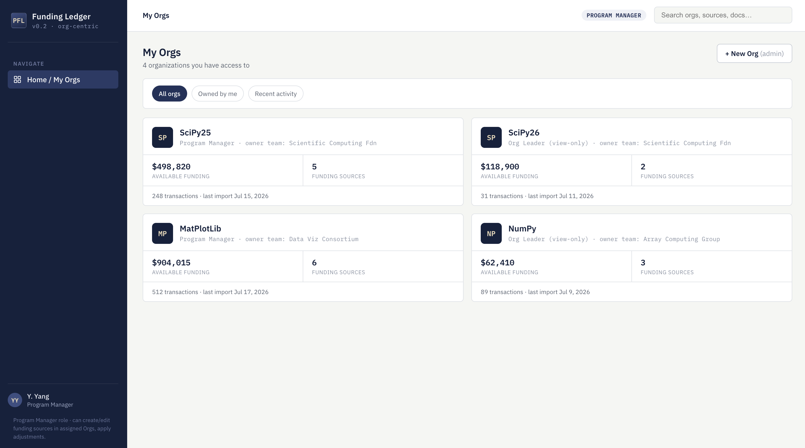
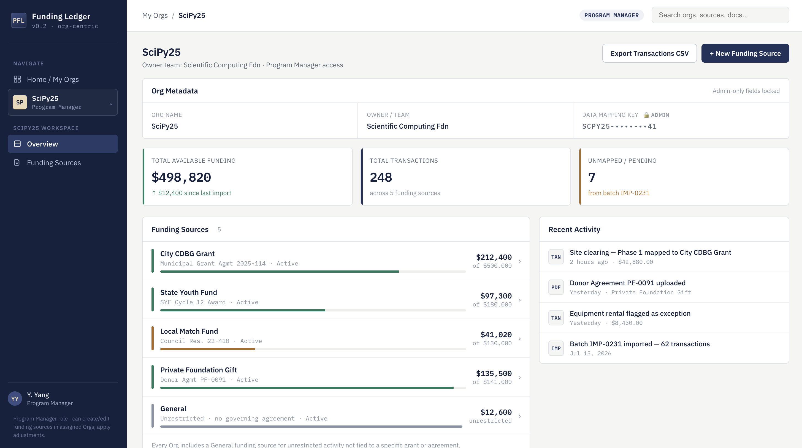
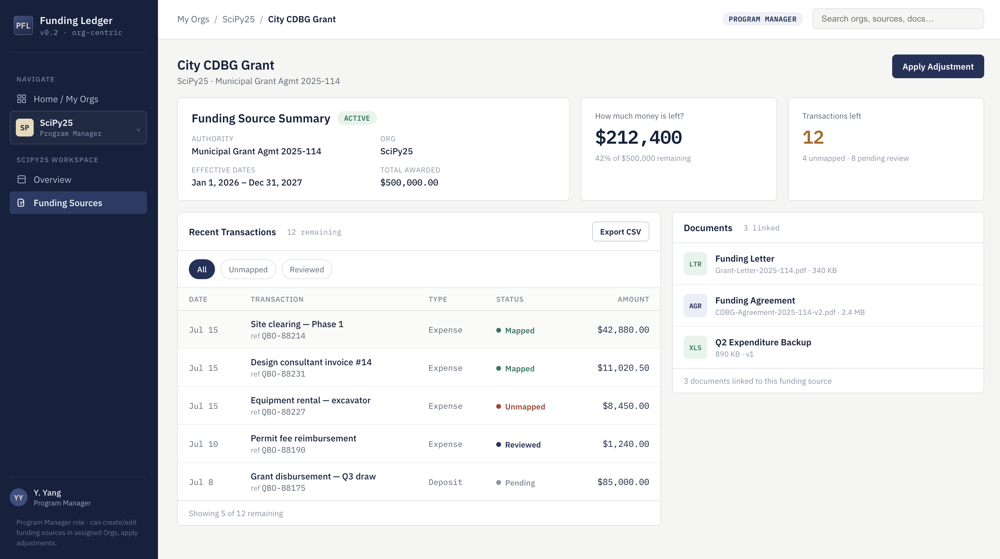

# UI Design — Mockups

## 1. Purpose

This document indexes the interactive frontend mockups for the Project
Funding Ledger (PFL) and records the design decisions made while
building them. It is a companion to the
[Architecture Design](../architecture/architecture-design.md) and
[Functional Specification](../functional-specification/functional-specification.md)
documents — this doc describes how the UI is being shaped, not the
underlying data model or business requirements.

## 2. Mockups

| File                                                                                             | Role / View     | Status   |
| ------------------------------------------------------------------------------------------------ | --------------- | -------- |
| [`mockups/pfl-dashboard-v1-program-manager.html`](mockups/pfl-dashboard-v1-program-manager.html) | Program Manager | v1 draft |

Each mockup is a single self-contained HTML file — open it directly in
a browser. There is no build step. It requires internet access on
first load to fetch the IBM Plex Sans / IBM Plex Mono fonts from
Google Fonts; without a connection it falls back to the system
default font but otherwise renders normally.

These are **clickable prototypes, not implementation code**. Layout,
navigation, and static sample data are representative; there is no
backend, no persistence, and interactive elements (buttons, filters)
are visual only unless noted.

### 2.1 Screenshots

Static captures of the three primary views, for quick reference
without opening the HTML file.

**My Orgs (home)**

**Org detail**
``

**Funding Source detail**
``

## 3. Scope of the v1 Program Manager mockup

Three views, matching the intended primary flow:

1. **My Orgs** (home) — list of accessible Orgs with role, funding
   summary, and recent activity.
2. **Org detail** — Org metadata, funding source list, recent
   activity feed.
3. **Funding Source detail** — the central page: summary metadata,
   "How much money is left?" / "Transactions left" metrics, Recent
   Transactions (bottom left), Documents (bottom right).

Sidebar navigation for this role is scoped to the selected Org once
one is open (Overview, Funding Sources), rather than exposing
global top-level sections for functions this role doesn't use.

## 4. Design decisions

- **"Organization" as the top-level entity** — the team has decided
  to rename the top-level organizational/security boundary from
  `project` to `organization` end-to-end — data model, API, and UI —
  rather than treating "Org" as a UI-only label over `project`. The
  architecture doc's `project` table and all `project_id` references
  should be updated to `organization` / `organization_id` to match.
  This is a rename, not a new entity: everything else in the
  architecture (Funding Sources, Financial Transactions, permissions,
  etc.) still hangs directly off this one top-level entity as before.
- **General funding source** — every Org's funding source list
  includes a "General" entry, matching the architecture requirement
  that each Project have an unrestricted default funding source for
  activity not tied to a specific grant or agreement.
- **No partial / split funding source assignment** — the mockup
  originally showed a transaction split across two funding sources
  ("Partial" status). This was removed for v1: `financial_transaction`
  assigns to exactly one `funding_source_id` in the architecture, so
  the UI shows single-source assignment only.
- **Admin/System nav hidden for this role** — this mockup represents
  the Program Manager's view specifically, so admin-only navigation
  (Admin section, "+ New Org") is not shown or is marked admin-only.
  A separate mockup would be needed to represent the Admin experience.
- **Funding Source detail has no internal tabs** — Overview,
  Transactions, and Documents are shown as static sections on one
  page (Overview top, Transactions bottom-left, Documents
  bottom-right) rather than as tabs, since tabbed navigation was
  judged redundant at this scale.

## 5. Known gaps / deferred to a later version

These exist in the architecture and/or functional spec but are not
yet represented in any mockup view:

- **Adjustments** — `funding_adjustment` records (award amendments,
  de-obligations) have no UI surface currently.
- **Audit / History** — per-entity audit trail is not shown.
- **Imports / Mapping** — batch import status and the mapping
  exception queue are out of scope for the Program Manager role in
  v1; this likely belongs to a Finance Administrator view.
- **Reports / Exports** — intended to live under the Funding Source
  page (e.g. next to the transactions table) rather than as its own
  section, but has not been designed yet.
- **Other roles** — System Administrator, Finance Administrator, and
  Project Stakeholder (view-only) views do not yet have mockups.
- **Transaction status values** — "Reviewed" and "Pending" appear in
  the mockup but are not part of the `mapping_status` enum
  (Mapped / Unmapped / Exception / Ignored) defined in the
  architecture doc. Needs a decision: fold into the existing enum,
  or formalize as an additional field.

## 6. Change log

| Date       | Change                                                                                                                                                                                                                                                                                                                      |
| ---------- | --------------------------------------------------------------------------------------------------------------------------------------------------------------------------------------------------------------------------------------------------------------------------------------------------------------------------- |
| 2026-07-19 | Initial Program Manager mockup: Org list, Org detail, Funding Source detail. Reconciled against architecture doc (General funding source added, partial-split removed). Nav simplified to remove Imports/Mapping, Reports/Exports, and Admin for this role; Funding Source detail tabs removed in favor of static sections. |
