# UI Design — Mockups

## 1. Purpose

This document indexes the interactive frontend mockups for the Project
Funding Ledger (PFL) and records the design decisions made while
building them. It is a companion to the
[Architecture Design](../architecture/architecture-design.md) and
[Functional Specification](../functional-specification/functional-specification.md)
documents — this doc describes how the UI is being shaped, not the
underlying data model or business requirements.

## 2. Mockups

| File                                                                                             | Role / View         | Status   |
| ------------------------------------------------------------------------------------------------ | ------------------- | -------- |
| [`mockups/pfl-dashboard-v1-program-manager.html`](mockups/pfl-dashboard-v1-program-manager.html) | Program Manager     | v1 draft |
| [`mockups/pfl-dashboard-v1-administrator.html`](mockups/pfl-dashboard-v1-administrator.html)     | Administrator       | v1 draft |
| [`mockups/pfl-dashboard-v1-stakeholder.html`](mockups/pfl-dashboard-v1-stakeholder.html)         | Project Stakeholder | v1 draft |

Each mockup is a single self-contained HTML file — open it directly in
a browser. There is no build step. It requires internet access on
first load to fetch the IBM Plex Sans / IBM Plex Mono fonts from
Google Fonts; without a connection it falls back to the system
default font but otherwise renders normally.

These are **clickable prototypes, not implementation code**. Layout,
navigation, and static sample data are representative; there is no
backend, no persistence, and most interactive elements (forms,
uploads, edits) update the UI in place but don't actually save
anything.

All three mockups share the same design system (colors, type,
components, CSS) and are kept in sync deliberately — see §4 for what's
allowed to differ between them and what isn't.

### 2.1 Screenshots

Static captures of each mockup's primary views, for quick reference
without opening the HTML files.

**Program Manager**

`[My Orgs](screenshots/pm-my-orgs.png)`
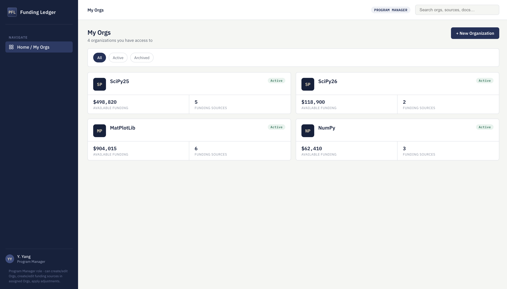

`[Org detail](screenshots/pm-org-detail.png)`
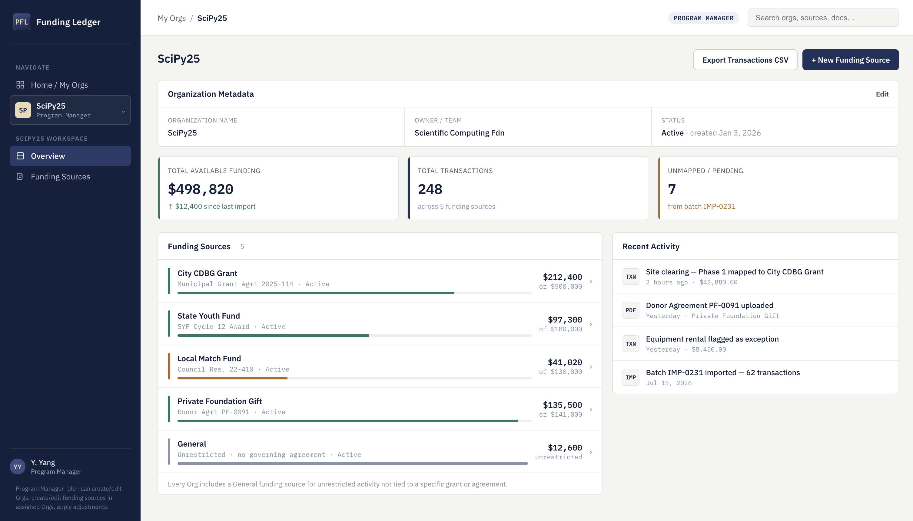

`[Funding Source detail](screenshots/pm-funding-source-detail.png)`
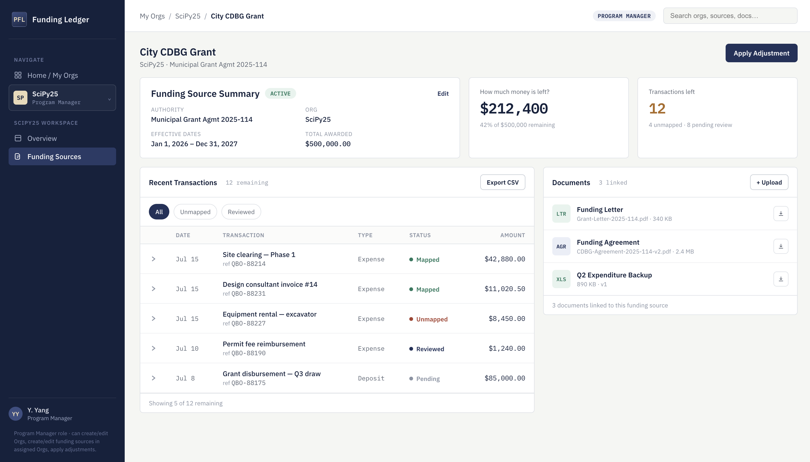

**Administrator**

`[Organizations](screenshots/admin-organizations.png)`
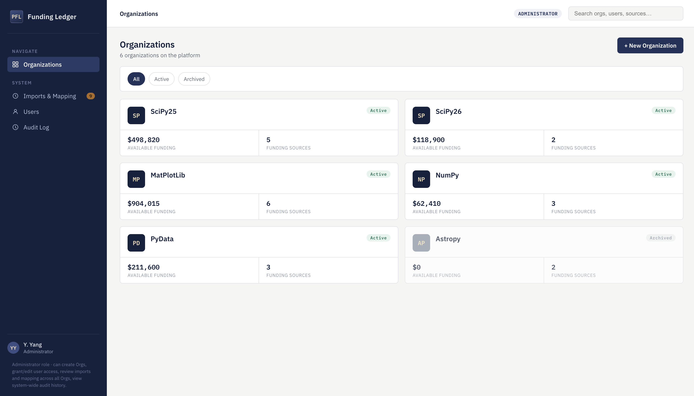

`[Org detail](screenshots/admin-org-detail.png)`
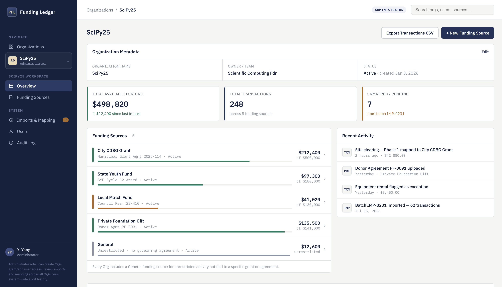

`[Users](screenshots/admin-users.png)`
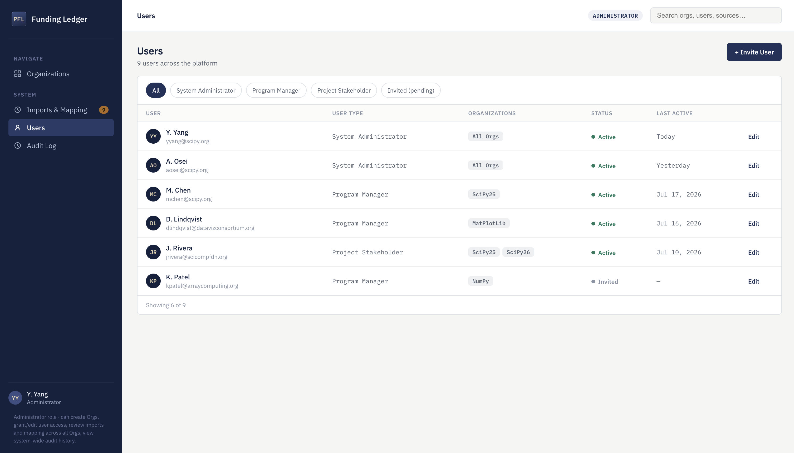

`[Imports & Mapping](screenshots/admin-imports-mapping.png)`
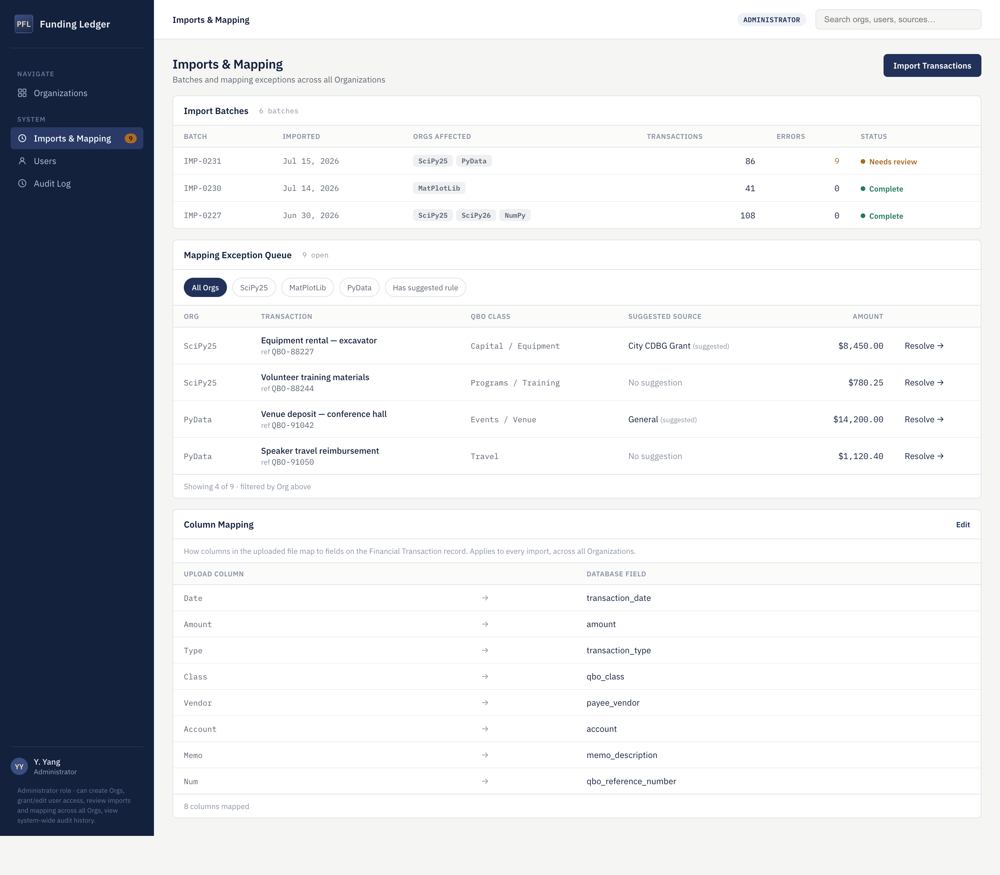

`[Audit Log](screenshots/admin-audit-log.png)`
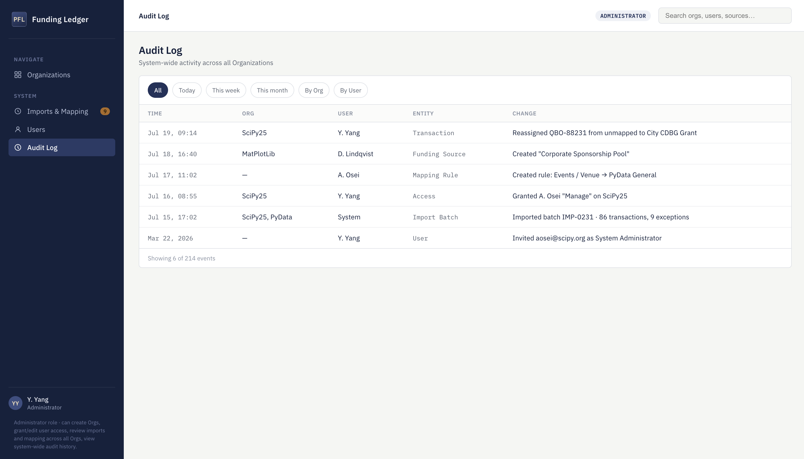

**Project Stakeholder**

`[My Orgs](screenshots/stakeholder-my-orgs.png)`
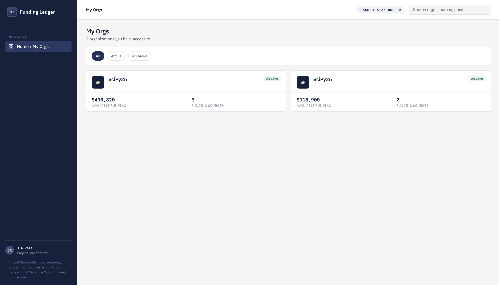

`[Org detail](screenshots/stakeholder-org-detail.png)`
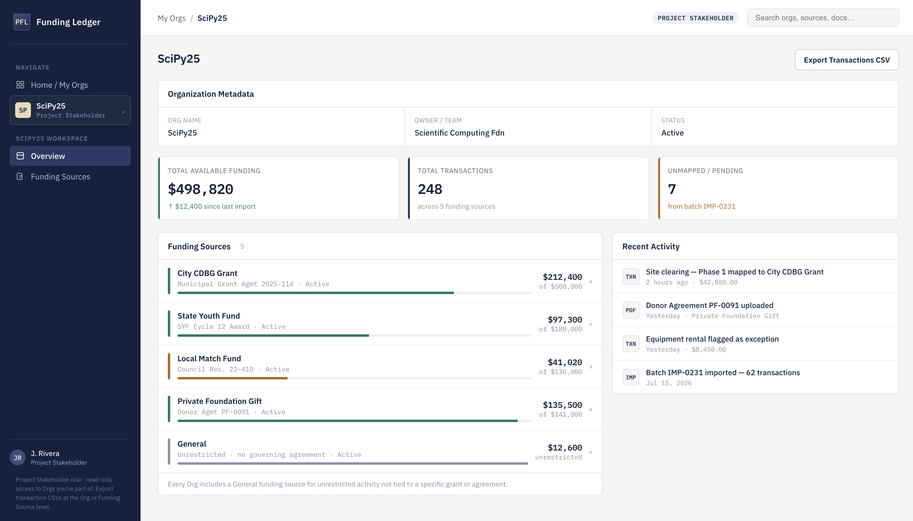

`[Funding Source detail](screenshots/stakeholder-funding-source-detail.png)`
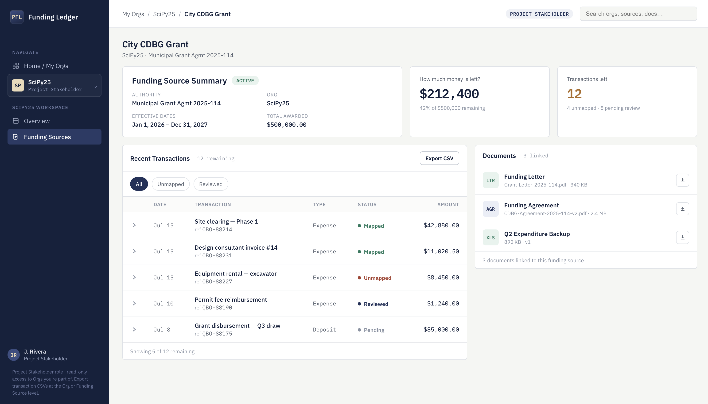

## 3. Scope

### 3.1 Program Manager mockup

Three views, matching the intended primary flow:

1. **My Orgs** (home) — Orgs the user has access to. Each card shows
   name, status (Active/Archived), Available Funding, and Funding
   Source count only — no role/owner-team subtitle or activity line.
   "+ New Organization" is enabled for this role.
2. **Org detail** — editable Organization Metadata (Name, Owner/Team,
   Status), funding source list, recent activity feed, and an
   "Export Transactions CSV" action.
3. **Funding Source detail** — the central page: summary metadata
   (editable inline), "How much money is left?" / "Transactions
   left" metrics, Recent Transactions (bottom left, rows expand for
   detail, with CSV export), Documents (bottom right, with upload
   and per-document download).

Sidebar navigation for this role is scoped to the selected Org once
one is open (Overview, Funding Sources), rather than exposing
global top-level sections for functions this role doesn't use.

### 3.2 Administrator mockup

Six views:

1. **Organizations** (home) — every Org on the platform regardless
   of membership, with the same card fields as Program Manager
   (name, status, Available Funding, Funding Sources) plus an
   enabled "+ New Organization" action.
2. **Org detail** — same editable Organization Metadata and actions
   as Program Manager, plus a compact Access summary linking to
   Users.
3. **Funding Source detail** — identical to the Program Manager view.
4. **Users** (global) — full user directory across all Orgs.
   Editing a user (modal) covers their user type, status, and
   Organization Access together in one place — there's no separate
   Access page. Inviting a user (modal) covers user type and, for
   non-admins, which Orgs to grant access to.
5. **Imports & Mapping** (global) — import batches (with an "Orgs
   Affected" column, since one upload can span multiple Orgs), the
   mapping exception queue (filterable by Org), and Column Mapping
   (how uploaded file columns map to Financial Transaction fields —
   editable, global, not Org-specific).
6. **Audit Log** (global) — flat, filterable table of system-wide
   activity (time, Org, user, entity, change). No per-entity
   drill-down in v1.

### 3.3 Project Stakeholder mockup

Same three-view shape as Program Manager (My Orgs → Org detail →
Funding Source detail) — read access to the full Org tree they
belong to, with every create/edit/upload action removed:

1. **My Orgs** — only the Orgs this user has access to (not the full
   platform). No "+ New Organization."
2. **Org detail** — Organization Metadata is read-only (no Edit).
   "Export Transactions CSV" is available.
3. **Funding Source detail** — full detail including Recent
   Transactions (expandable, with CSV export) and Documents
   (viewable and downloadable) — no metadata editing, no adjustment
   action, no document upload.

No system-level navigation — this role never sees Users, Imports &
Mapping, or Audit Log.

## 4. Design decisions

- **"Organization" as the top-level entity** — the team has decided
  to rename the top-level organizational/security boundary from
  `project` to `organization` end-to-end — data model, API, and UI —
  rather than treating "Org" as a UI-only label over `project`. The
  architecture doc's `project` table and all `project_id` references
  should be updated to `organization` / `organization_id` to match.
  This is a rename, not a new entity: everything else in the
  architecture (Funding Sources, Financial Transactions, permissions,
  etc.) still hangs directly off this one top-level entity as before.
- **General funding source** — every Org's funding source list
  includes a "General" entry, matching the architecture requirement
  that each Project have an unrestricted default funding source for
  activity not tied to a specific grant or agreement.
- **No partial / split funding source assignment** — the mockup
  originally showed a transaction split across two funding sources
  ("Partial" status). This was removed for v1: `financial_transaction`
  assigns to exactly one `funding_source_id` in the architecture, so
  the UI shows single-source assignment only.
- **Funding Source detail has no internal tabs** — Overview,
  Transactions, and Documents are shown as static sections on one
  page (Overview top, Transactions bottom-left, Documents
  bottom-right) rather than as tabs, since tabbed navigation was
  judged redundant at this scale.
- **System Administrator and Finance Administrator are one role** —
  the architecture doc originally split these into two `user_type`
  values. The team decided they're the same role; the mockups and
  this doc now use "System Administrator" only.
- **Permission level is gone as a separate concept** — the
  architecture doc's `project_permission.permission_level` (View /
  Edit Metadata / Manage) is no longer configured per Org/user pair.
  User type alone now determines capability. Granting access to an
  Org is now just membership, with no separate level to set.
- **System Administrators automatically have access to every
  Organization** — they don't appear in any per-Org access list; the
  UI shows this as "All Orgs" rather than an explicit grant. Other
  user types still need to be added to each Org individually.
- **Access management lives inside Users, not as its own page** —
  editing a user's Organization Access happens in the same modal as
  editing their user type and status. An Org detail page shows who
  has access as a read-only summary with a link into Users, rather
  than duplicating a full table.
- **The Data Mapping Key is never shown in the UI** — it's a backend
  record ID linking an Org to the financial system, not a
  user-facing field. No mockup — any role — displays or edits it
  directly.
- **Mapping Rules = Column Mapping, not business rules** — originally
  modeled as "QBO Class → Funding Source" assignment rules. Corrected
  per team input: mapping rules are simply how columns in an uploaded
  file correspond to fields on the Financial Transaction record
  (e.g. "Vendor" → `payee_vendor`). This is global and structural,
  not an Org-specific business rule, and is now editable from Imports
  & Mapping.
- **Imports & Mapping is global, not Org-scoped** — a single upload
  batch can contain transactions for multiple Orgs, so batches and
  the exception queue show/filter by Org rather than living inside
  one Org's workspace.
- **Modals vs. inline editing** — Invite User and Edit User use a
  modal (consistent header/close/footer pattern) since they're
  triggered from a flat list and need focus. Org metadata, Funding
  Source metadata, and Column Mapping use inline expand-in-place
  forms instead, since they're edits to content already in view.
- **Program Manager can create and edit Organizations, same as
  Administrator.** This was originally Administrator-only ("the
  finance person"), but Program Managers shouldn't have to wait on
  Administrator availability to stand up or correct an Org they're
  responsible for. The practical difference between the two roles is
  now: Administrator sees every Org on the platform regardless of
  membership, and only Administrator has Users, Imports & Mapping,
  and Audit Log. This is a narrower gap than the architecture doc
  originally implied (Org creation as System-Administrator-only) —
  see the open question in §5.
- **Funding Source metadata is editable by both Program Manager and
  Administrator.** Neither can edit which Org a Funding Source
  belongs to once created.
- **Recent Transactions rows are expandable** — clicking a row
  reveals Payee/Vendor, Account, Funding Source, and mapping notes
  inline, rather than linking to a separate transaction detail page.
- **Document upload and download** — the Funding Source Documents
  panel has an upload action (Document Type + file) for Program
  Manager and Administrator. Every role, including Project
  Stakeholder, can download individual documents — downloading isn't
  an edit action.
- **Org list cards are intentionally minimal** — name, status
  (Active/Archived), Available Funding, and Funding Source count
  only. Role/owner-team text and a transactions/last-import line were
  removed as unnecessary detail for a list view; that information is
  available one click away on Org detail.
- **Org list filters are the same three options everywhere** — All /
  Active / Archived, regardless of role. (Program Manager's and
  Stakeholder's lists were previously "All orgs / Owned by me /
  Recent activity" and "All orgs / Recent activity" respectively;
  standardized to match Administrator.)
- **Redundant subtitles removed** — the sidebar no longer shows a
  version/scope tag under "Funding Ledger" (was inconsistent across
  mockups: "org-centric," "admin," "view-only"), and Org detail no
  longer repeats Owner/Team and Status in a page-level subtitle since
  both are already shown in the Organization Metadata panel directly
  below.
- **A full cross-mockup consistency pass was done** — shared UI
  (nav labels, button text, panel headers, CSS rules) is now
  identical across all three files except where role/access
  genuinely differs. This was checked with a structural CSS diff
  across all three files, not just visual spot-checking, after
  several rounds of silent drift (e.g. a stale `padding: 0` on
  `.form-panel` in the Program Manager file that Administrator had
  already fixed).

## 5. Known gaps / open questions

- **Adjustments** — `funding_adjustment` records (award amendments,
  de-obligations) have no UI surface in any mockup.
- **Reports / Exports** — intended to live under the Funding Source
  page rather than as its own section, but has not been designed.
- **Transaction status values** — "Reviewed" and "Pending" appear in
  the mockups but are not part of the `mapping_status` enum
  (Mapped / Unmapped / Exception / Ignored) defined in the
  architecture doc. Needs a decision: fold into the existing enum,
  or formalize as an additional field.
- **`project_permission.permission_level` is now stale** — the
  architecture doc still defines View / Edit Metadata / Manage as a
  per-Org, per-user setting. Per the decisions above, this concept
  has been dropped from the UI in favor of user type alone. The
  architecture doc needs a corresponding update (similar to the
  Organization rename) or a decision to keep the field and add it
  back to the UI.
- **Program Manager / Administrator overlap is now large** — both
  can create and edit Orgs and Funding Sources. Worth confirming
  this is intentional, since it changes the security model implied
  by the architecture doc (which scoped Org creation to System
  Administrator). If Administrator is meant to retain any org-level
  exclusivity beyond platform-wide visibility and the System nav
  section, that needs to be named explicitly.
- **Mapping suggestion logic has no visible owner** — the exception
  queue shows suggested funding sources (e.g. "City CDBG Grant
  (suggested)"), but now that Mapping Rules = Column Mapping, there's
  no UI explaining what generates those suggestions. Needs either a
  dedicated section or an explicit decision that it's a backend-only
  mechanism with no admin configuration surface.
- **"Q2 Expenditure Backup" sample document** — flagged as a
  possible conflict with the architecture doc's exclusion of
  transaction-level accounting support documents (invoices, receipts,
  reimbursement backup). Worth confirming this document type is
  actually in scope before it becomes a pattern.

## 6. Change log

| Date       | Change                                                                                                                                                                                                                                                                                                                                                                                                                                                                                                                                                                                                                                                                                                                                           |
| ---------- | ------------------------------------------------------------------------------------------------------------------------------------------------------------------------------------------------------------------------------------------------------------------------------------------------------------------------------------------------------------------------------------------------------------------------------------------------------------------------------------------------------------------------------------------------------------------------------------------------------------------------------------------------------------------------------------------------------------------------------------------------ |
| 2026-07-19 | Initial Program Manager mockup: Org list, Org detail, Funding Source detail. Reconciled against architecture doc (General funding source added, partial-split removed). Nav simplified to remove Imports/Mapping, Reports/Exports, and Admin for this role; Funding Source detail tabs removed in favor of static sections.                                                                                                                                                                                                                                                                                                                                                                                                                      |
| 2026-07-19 | Added Administrator mockup: Organizations, Org detail, Funding Source detail, Users, Imports & Mapping, Audit Log. Merged System/Finance Administrator into one role. Removed permission_level from the UI in favor of user-type-based access, with automatic all-Org access for System Administrators. Folded Access into Users (modal-based editing). Reworked Mapping Rules into Column Mapping (upload column → database field). Added expandable transaction rows, inline Funding Source metadata editing (both roles), and document upload — applied to both mockups.                                                                                                                                                                      |
| 2026-07-19 | Added Project Stakeholder mockup: My Orgs, Org detail, Funding Source detail — full read access to their Org tree with all edit/create/upload actions removed; CSV export and document download retained. Granted Program Manager the ability to create and edit Organizations (previously Administrator-only). Added document download to all three mockups. Simplified Org list cards to name/status/funding/source-count only, removed activity and role/owner-team lines. Standardized Org list filters to All/Active/Archived everywhere. Removed redundant sidebar version tag and Org detail subtitle. Completed a full cross-mockup consistency pass (CSS-diffed), fixing several small drift issues accumulated across the three files. |
